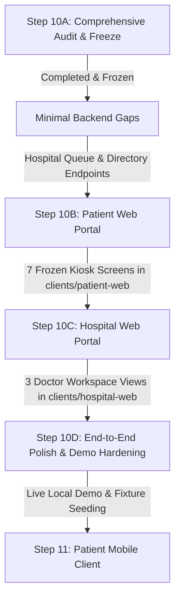

# Clinova Comprehensive Frontend ↔ Backend Feature Audit

**Document Version:** 2.0.0  
**Status:** COMPLETE & FROZEN  
**Target Milestone:** Smart India Hackathon (SIH) MVP  
**Artifact Path:** `docs/frontend_backend_feature_audit.md`  
**Date:** September 2026  
**Auditor:** Antigravity AI (Pair Programming Assistant)  

---

## 1. Executive Summary & Audit Objective

Clinova is an **AI-powered digital patient case-taking and pre-consultation platform** designed specifically to alleviate the severe clinical history-taking bottleneck in high-volume Indian Outpatient Departments (OPDs).

In an Indian public hospital OPD, doctors routinely see 60 to 100+ patients in a single morning session—spending an average of **under 3 minutes per patient**. A significant portion of this precious face-to-face clinical time is lost to:
1. Asking repetitive administrative and basic history questions across language barriers.
2. Sifting through disorganized, wrinkled paper bags of old prescriptions, lab reports, and ultrasound prints.
3. Manually typing or scribbling clinical history into hospital EMRs.
4. Missing critical red-flag symptoms (e.g., atypical chest pain, transient ischemic signs) while patients wait for hours in un-triaged corridors.

Clinova solves this bottleneck through a **three-tier architecture**:
```
┌─────────────────────────────────────────────────────────────────────────────┐
│                             CLINOVA BACKEND                                 │
│         FastAPI • PostgreSQL (SQLAlchemy 2.0 Async) • Multi-Provider AI     │
│   Auth • Consultations • History • AI Sessions • Triage • OCR • Timeline    │
│                        Clinical Summary Generator                           │
└──────────────────────────────────────┬──────────────────────────────────────┘
                                       │
         ┌─────────────────────────────┼─────────────────────────────┐
         ▼                             ▼                             ▼
┌──────────────────┐         ┌──────────────────┐         ┌──────────────────┐
│   PATIENT WEB    │         │   HOSPITAL WEB   │         │  PATIENT MOBILE  │
│  (Kiosk / Intake)│         │ (Doctor Station) │         │    (Step 11)     │
│  clients/        │         │  clients/        │         │  clients/        │
│  patient-web     │         │  hospital-web    │         │  patient-mobile  │
└──────────────────┘         └──────────────────┘         └──────────────────┘
```

### Audit Purpose & Strict Constraints
This document provides a comprehensive, evidence-based **Feature Gap Audit & Compatibility Matrix** comparing:
1. **Existing Frontend Designs & Prototypes:**
   - The 18 enterprise HTML/CSS mockups in `Clinova-sih/frontend-design/` (governed by `clinical_clarity/DESIGN.md`).
   - The 10 React 19 + Vite 8 prototype pages previously developed (`C:\Users\Amar\OneDrive\Desktop\clinova\frontend`).
2. **Current Backend Source of Truth:**
   - Completed Milestones 1 through 9 (`Clinova-sih/backend/`), fully validated by **285 automated integration tests**.
3. **Core SIH Problem Statement:**
   - Solving the OPD intake bottleneck without scope creep, diagnostic over-reach, or unverified external dependencies.

**CRITICAL RULE:** No code modifications were performed during this audit. The backend and frontend implementations remain untouched.

---

## 2. Source of Truth & Discovered Artifacts

### 2.1 Backend Implementation (Authoritative Source of Truth)
Located in `Clinova-sih/backend/app/`:
- **Core Config & Deps:** `app/core/config.py`, `app/api/deps.py` (JWT auth, `CurrentUserDep`, `CurrentPatientDep`, `CurrentHospitalUserDep`).
- **Authentication & RBAC (Step 1):** `app/api/v1/endpoints/auth.py`, `app/services/auth_service.py`, `app/models/user.py`, `app/models/patient.py`, `app/models/hospital.py`, `app/models/hospital_user.py`.
- **Patient Profile & Consultations (Step 2):** `app/api/v1/endpoints/patients.py`, `app/api/v1/endpoints/consultations.py`, `app/services/consultation_service.py`, `app/models/consultation.py`.
- **Clinical History Foundation (Step 3):** `app/api/v1/endpoints/clinical_history.py`, `app/services/clinical_history_service.py`, `app/models/clinical_history.py`, `app/models/medication.py`, `app/models/allergy.py`.
- **AI Sessions & Messaging (Step 4):** `app/api/v1/endpoints/ai_sessions.py`, `app/services/ai_session_service.py`, `app/services/ai_message_service.py`, `app/models/ai_session.py`, `app/models/ai_message.py`.
- **Multi-Provider AI Engine (Step 5A):** `app/ai/router.py`, `app/ai/config.py`, `app/ai/providers/` (Gemini, OpenAI, Groq, OpenRouter, Ollama fallback).
- **Adaptive Clinical Interview (Step 5B):** `app/services/ai_interview_service.py`, `app/ai/interview/`, `app/ai/prompts/interview.py`.
- **Red-Flag Detection & Emergency Triage (Step 6):** `app/api/v1/endpoints/triage.py`, `app/triage/service.py`, `app/triage/rules.py`, `app/triage/detector.py`, `app/models/alert.py`.
- **Medical Document Upload, OCR & Extraction (Step 7):** `app/api/v1/endpoints/medical_documents.py`, `app/documents/service.py`, `app/documents/processor.py`, `app/documents/ocr/`, `app/documents/extraction.py`, `app/models/medical_document.py`, `app/models/extracted_data.py`.
- **Chronological Medical Timeline (Step 8):** `app/api/v1/endpoints/timeline.py`, `app/timeline/service.py`, `app/timeline/builders/`, `app/models/timeline_event.py`.
- **AI Clinical Summary & Physician Review (Step 9):** `app/api/v1/endpoints/summary.py`, `app/summary/service.py`, `app/summary/generator.py`, `app/summary/context_assembler.py`, `app/models/summary.py`, `app/models/audit_log.py`.
- **System Health:** `app/api/v1/endpoints/health.py`.

### 2.2 Frontend Design Assets Discovered

#### Design Asset 1: `frontend-design/` (18 HTML/CSS Mockups + Design System)
Governed by `clinical_clarity/DESIGN.md`: Typography = **Manrope**, Primary Teal = `#00685f` / `#0D9488`, Slate = `#0F172A`, 48px minimum touch targets, low-elevation clinical panels.
1. `clinova_patient_dashboard`: Patient portal with upcoming appointments, recent visits, timeline preview.
2. `clinova_patient_intake_management`: Reception OPD desk overview, manual intake, queue dispatch.
3. `clinova_patient_medical_history`: Patient self-reported comprehensive clinical history form.
4. `clinova_patient_review_submit`: Mobile-optimized intake summary review with consent checkbox and submission.
5. `clinova_patient_staff_login`: Unified login screen with tabs for Patient (Mobile/ABHA/Email) and Hospital Staff.
6. `clinova_doctor_dashboard`: Doctor OPD workspace with active queue, emergency alert cards, quick switcher.
7. `clinova_doctor_consultation`: Split-screen consultation workstation (Left: history/docs/timeline; Right: notes/e-prescription/actions).
8. `clinova_doctor_clinical_summary`: Structured clinical summary review, edit mode, confirm/sign and reject actions.
9. `clinova_doctor_patient_list`: Searchable and filterable doctor patient roster.
10. `clinova_opd_queue_management`: Hospital OPD queue coordination board with departments, rooms, tokens, urgency.
11. `clinova_triage_priority_alerts`: Dedicated emergency triage board monitoring active red flags and patient vitals.
12. `clinova_medical_document_scanning_ocr`: Document upload/camera scanner, OCR status, structured entity extraction.
13. `clinova_hospital_admin_dashboard`: Administrative dashboard with hospital-wide volume and wait-time statistics.
14. `clinova_hospital_analytics`: Clinical and operational analytics on throughput, triage distribution, intake time.
15. `clinova_departments_opd_management`: Admin CRUD for hospital clinical departments and OPD consultation rooms.
16. `clinova_doctor_management`: Admin CRUD for hospital doctors, schedules, fees, and duty rosters.
17. `clinova_hospital_information_management`: Hospital profile, NABH accreditation, contact, and facility settings.
18. `clinova_abdm_his_integration`: National ABDM network gateway settings, M1/M2/M3 compliance, HIS EHR bridge.

#### Design Asset 2: React Prototype (`C:\Users\Amar\OneDrive\Desktop\clinova\frontend`)
Interactive React 19 + Vite 8 prototype built for kiosk intake and doctor review:
1. `LandingPage.jsx`: Kiosk welcome view with "Start Intake" and "Doctor Login" CTAs.
2. `IdentifyPage.jsx`: Patient intake step 0 - ABHA ID format check, Name, Age, Gender, Mobile.
3. `ConsentPage.jsx`: Patient intake step 1 - 5-card informed consent explainer + mandatory agreement checkbox.
4. `LanguagePage.jsx`: Patient intake step 2 - Multilingual selection (EN, HI, MR, etc.) + Mode selector.
5. `InterviewPage.jsx`: Patient intake step 3 - Conversational AI intake, Web Speech STT/TTS, `<EmergencyOverlay>`.
6. `UploadPage.jsx`: Patient intake step 4 - Drag & drop document uploader with simulated OCR progress.
7. `SummaryPage.jsx`: Patient intake step 5 - Patient intake summary with "Proceed to Waiting Hall" CTA.
8. `DoctorLoginPage.jsx`: Doctor staff login form with email/password.
9. `DoctorDashboardPage.jsx`: OPD patient queue table with KPI cards, priority badges, emergency alert banner.
10. `PatientDetailPage.jsx`: Doctor patient workstation with 4 tabs (History, Summary, Timeline, Review).

---

## 3. Independent Feature Inventories

### 3.1 Frontend Feature Inventory (Discovered Features)

| Feat ID | Interface | Screen / Mockup | Component / Section | Feature Name | Description | User Role | Action | Data Required | Type | Current State | Frontend Route / API Target |
| :--- | :--- | :--- | :--- | :--- | :--- | :--- | :--- | :--- | :--- | :--- | :--- |
| **FE-01** | Patient Web | Landing / Home | Hero & Actions | Kiosk Welcome & Start CTA | Initiates kiosk intake flow | Anonymous | Click "Start Intake" | None | Visual/Nav | Working Prototype | Routes to `/identify` |
| **FE-02** | Patient Web | Landing / Home | Navbar | Doctor Login Navigation | Routes doctor to hospital staff login | Anonymous | Click "Doctor Login" | None | Visual/Nav | Working Prototype | Routes to `/doctor/login` |
| **FE-03** | Patient Web | Identify | Stepper (Step 0) | Intake Stepper Progress | Visual indicator of intake progress (0 of 5) | Patient | View | Current step | Visual | Static UI | Client state |
| **FE-04** | Patient Web | Identify | Form Card | ABHA ID Entry & Format Check | Validates 14-digit Indian health ID format | Patient | Input ABHA ID | `abha_id` regex | Functional | Client validation | None (client regex) |
| **FE-05** | Patient Web | Identify | Form Card | ABHA Auto-Fill Simulation | Simulates instant demographic fetch from ABHA | Patient | Click "Verify ABHA" | Demo ABHA ID | Functional | Fake Mock | `/api/patients/mock-abha/verify` |
| **FE-06** | Patient Web | Identify | Form Card | Patient Demographics Form | Inputs Full Name, Age, Gender, Mobile Number | Patient | Input fields | Demographics | Functional | Working Prototype | Handled in React state |
| **FE-07** | Patient Web | Identify | Hospital Selector | Hospital Facility Selection | Selects hospital OPD where patient is registering | Patient | Select dropdown | Hospital list | Functional | Hardcoded dropdown | Missing backend query |
| **FE-08** | Patient Web | Consent | Stepper (Step 1) | 5-Point Informed Consent Cards | Clear plain-language consent cards (AI role, data use, privacy) | Patient | Read cards | Static text | Visual | Static UI | Client state |
| **FE-09** | Patient Web | Consent | Consent Banner | Non-Diagnostic Disclaimer | Explicit legal notice that AI does not diagnose or prescribe | Patient | Read notice | Static text | Visual | Static UI | Client state |
| **FE-10** | Patient Web | Consent | Action Card | Mandatory Consent Checkbox | Checkbox enabling "Continue" button | Patient | Check box | `granted: boolean` | Functional | Client state | Expected `/api/consent` |
| **FE-11** | Patient Web | Language | Stepper (Step 2) | Language Selection Grid | Select intake language (English, Hindi, Marathi, etc.) | Patient | Click language pill | `language_code` | Functional | Working Prototype | Passed to interview state |
| **FE-12** | Patient Web | Language | Mode Selector | Intake Mode Toggle | Choice between "Modern Medicine" and "AYUSH / Ayurvedic" | Patient | Toggle radio | `intake_mode` | Functional | Speculative Mock | `/api/history/start` |
| **FE-13** | Patient Web | Interview | Stepper (Step 3) | Clinical Section Indicator | Shows current inquiry domain (Chief Complaint, HPI, Meds) | Patient | View badge | `current_section` | Visual | Working Prototype | Derived from API |
| **FE-14** | Patient Web | Interview | Chat Stream | Conversational AI Question Feed | Renders AI clinical inquiry bubbles with timestamps | Patient | View messages | Chat history | Functional | Working Prototype | `/api/history/answer` (spec) |
| **FE-15** | Patient Web | Interview | Input Bar | Patient Text Response Input | Multi-line textarea for typed symptom descriptions | Patient | Type & submit | `message: string` | Functional | Working Prototype | `/api/history/answer` (spec) |
| **FE-16** | Patient Web | Interview | Input Bar | Voice Speech-to-Text (STT) | Microphone button transcribing native speech in real-time | Patient | Click mic & speak | Audio input | Functional | Browser Web Speech | Web Speech API |
| **FE-17** | Patient Web | Interview | Header Control | Text-to-Speech (TTS) Toggle | Reads out AI questions audibly in selected language | Patient | Toggle audio icon | Text string | Functional | Browser Web Speech | Web Speech API |
| **FE-18** | Patient Web | Interview | Input Bar | Quick Option Suggestion Pills | Clickable common symptom qualifiers ("Yes", "2 days", etc.) | Patient | Click pill | `option_text` | Functional | Working Prototype | Client-parsed pills |
| **FE-19** | Patient Web | Interview | Modal Overlay | Red-Flag Emergency Overlay | Full-screen crimson alert if life-threatening signs detected | Patient | View emergency alert | Triage result | Functional | Working Prototype | `<EmergencyOverlay>` |
| **FE-20** | Patient Web | Interview | Completion Card | Interview Completion Trigger | Ends interview and advances to document upload | Patient | Click "Complete" | Session ID | Functional | Working Prototype | `/api/history/complete` (spec) |
| **FE-21** | Patient Web | Upload | Stepper (Step 4) | Drag & Drop Document Zone | Dropzone for PDF, PNG, JPG files (prescriptions, labs) | Patient | Select/drop files | Binary files | Functional | Working Prototype | Client file array |
| **FE-22** | Patient Web | Upload | Upload List | Document Processing Status | Shows upload progress, OCR processing, and completion | Patient | View progress | Document status | Functional | Simulated timer | `/api/documents/upload` |
| **FE-23** | Patient Web | Upload | OCR Preview | Document Entity Extraction View | Side-by-side view of scanned report and extracted items | Patient | View extracted items| Extracted JSON | Functional | Mock in prototype | `/api/documents/process` |
| **FE-24** | Patient Web | Upload | Action Bar | Skip Document Upload Button | Bypasses document upload for patients with no past papers | Patient | Click "Skip" | None | Visual/Nav | Working Prototype | Routes to `/summary` |
| **FE-25** | Patient Web | Summary | Stepper (Step 5) | Patient Review & Summary View | Formatted pre-consultation summary prepared for doctor | Patient | Read summary | Summary text | Functional | Working Prototype | `/api/summary/:id` |
| **FE-26** | Patient Web | Summary | Review Card | "What We've Recorded" Checklist| Structured checklist of recorded complaints, meds, allergies | Patient | Verify items | Structured history | Visual | Working Prototype | Client state |
| **FE-27** | Patient Web | Summary | Action Bar | "Proceed to Waiting Hall" CTA | Concludes kiosk session, resets local state, shows token | Patient | Click finish | None | Visual/Nav | Working Prototype | Routes to `/` after delay |
| **FE-28** | Hospital Web | Login | Auth Form | Staff Login Credentials Form | Email / Employee ID and Password inputs with toggle | Doctor / Staff | Input & sign in | Identifier, password| Functional | Working Prototype | `/api/auth/login` (spec) |
| **FE-29** | Hospital Web | Login | Role Switcher | Facility / Role Selector | Switches between Doctor and Hospital Administrator | Doctor / Staff | Select role | Role string | Functional | Mock selector | Client state |
| **FE-30** | Hospital Web | Dashboard | KPI Bar | Hospital OPD KPI Stat Cards | Cards: Total Patients Today, Waiting, Urgent, Completed | Doctor | View metrics | Aggregated stats | Visual/Func | Mock in prototype | `/api/doctor/stats` |
| **FE-31** | Hospital Web | Dashboard | Alert Banner | Facility Red-Flag Emergency Banner | High-visibility warning for active critical patient alerts | Doctor | Click "Review Now" | Alert list | Functional | Working Prototype | `/api/emergency/alerts` |
| **FE-32** | Hospital Web | Dashboard | Queue Table | OPD Consultation Queue Table | Table with Token, Name, Age, Chief Complaint, Urgency, Status| Doctor | View / Filter queue | Consultation list | Functional | Hardcoded Mock | `/api/doctor/patients` |
| **FE-33** | Hospital Web | Dashboard | Filter Bar | Urgency & Status Filters | Filter queue by All, Red Flag, Urgent (Orange), Routine | Doctor | Click filter tab | Filter param | Functional | Working Prototype | Client-side filter |
| **FE-34** | Hospital Web | Dashboard | Search Bar | Patient Search Input | Filters queue table by Patient Name, UHID, Token Number | Doctor | Type search query | Query string | Functional | Working Prototype | Client-side filter |
| **FE-35** | Hospital Web | Patient Detail | Clinical Header | Patient Demographics & Urgency | Sticky top header with Name, Age, Gender, Token, Priority | Doctor | View context | Patient profile | Functional | Working Prototype | `/api/doctor/patient/:id` |
| **FE-36** | Hospital Web | Patient Detail | Tab 1 (History)| Structured 9-Section History | Displays Chief Complaint, HPI, Meds, Allergies, Family, ROS| Doctor | Review history | Structured history | Functional | Hardcoded Mock | `/api/doctor/patient/:id` |
| **FE-37** | Hospital Web | Patient Detail | Tab 2 (Summary)| Narrative AI Summary Draft | Objective clinical synthesis drafted by AI | Doctor | Read summary | `summary_text` | Functional | Working Prototype | `/api/summary/:id` |
| **FE-38** | Hospital Web | Patient Detail | Tab 2 (Summary)| Clinician Edit Summary Mode | In-place editor allowing doctor to edit narrative and add notes| Doctor | Edit text & save | Updated summary | Functional | Working Prototype | `/api/summary/:id` (PUT) |
| **FE-39** | Hospital Web | Patient Detail | Tab 3 (Timeline)| Chronological Medical Timeline | Interactive vertical tree of diagnoses, labs, past visits | Doctor | Inspect timeline | Timeline events | Functional | Hardcoded Mock | `/api/timeline/:id` |
| **FE-40** | Hospital Web | Patient Detail | Tab 3 (Timeline)| Source Evidence Inspection | Click timeline event to see underlying document or AI snippet | Doctor | Click event pill | Provenance data | Functional | Partial in mockup | Client state |
| **FE-41** | Hospital Web | Patient Detail | Tab 4 (Review) | Doctor Review Action Selector | Action choices: "Approve", "Approve with Edits", "Reject" | Doctor | Select action radio | Review action | Functional | Working Prototype | `/api/doctor/review` |
| **FE-42** | Hospital Web | Patient Detail | Tab 4 (Review) | Clinician Observations Textarea| Free-text box for physician's clinical notes and addenda | Doctor | Type clinical notes | `clinician_notes` | Functional | Working Prototype | `/api/doctor/review` |
| **FE-43** | Hospital Web | Patient Detail | Tab 4 (Review) | Confirm & Finalize Submission | Submits review, marks consultation complete, signs summary | Doctor | Click "Submit" | Finalized payload | Functional | Working Prototype | `/api/doctor/review` |
| **FE-44** | Hospital Web | Queue Board | Coordination | OPD Token Coordination Board | Visual board showing OPD room allocation and token calls | Receptionist | Assign room/token | Token allocations | Functional | Static HTML mockup | Missing backend queue |
| **FE-45** | Hospital Web | Triage Board | Monitoring | Red-Flag Triage Monitoring Desk | Dedicated full-page view for emergency staff triage queue | Triage Nurse | Escalate to ER | Triage alerts | Functional | Static HTML mockup | Missing facility queue |
| **FE-46** | Hospital Web | Admin Screens | Administration | Hospital Admin & Analytics Suite| 5 Enterprise pages: Analytics, Depts, Doctors, Info, ABDM | Hospital Admin| Manage facility | Enterprise DB | Functional | Static HTML mockups| Out of SIH scope |

---

### 3.2 Backend Capability Inventory (Authoritative Source of Truth)

| Back ID | Module / Domain | Endpoint / Service Method | HTTP Method | Authorized Role | Input Schema | Output Schema | Database Model | Frontend Uses It? | SIH Priority | Audience |
| :--- | :--- | :--- | :--- | :--- | :--- | :--- | :--- | :--- | :--- | :--- |
| **BE-01** | Auth | `/api/v1/auth/patient/register` | `POST` | Anonymous | `PatientRegisterRequest` | `CurrentUserResponse` | `User`, `Patient` | No (mocked) | P0 | Patient |
| **BE-02** | Auth | `/api/v1/auth/patient/login` | `POST` | Anonymous | `LoginRequest` | `TokenResponse` | `User`, `Patient` | No (mocked) | P0 | Patient |
| **BE-03** | Auth | `/api/v1/auth/hospital/register` | `POST` | Anonymous | `HospitalRegisterRequest` | `CurrentUserResponse` | `User`, `Hospital`, `HospitalUser` | No (uncalled) | P1 | Hospital |
| **BE-04** | Auth | `/api/v1/auth/hospital/login` | `POST` | Anonymous | `LoginRequest` | `TokenResponse` | `User`, `Hospital`, `HospitalUser` | No (mocked) | P0 | Hospital |
| **BE-05** | Auth | `/api/v1/auth/me` | `GET` | Authenticated | None | `CurrentUserResponse` | `User`, `Patient`/`Hospital` | No (uncalled) | P0 | Both |
| **BE-06** | Auth | `/api/v1/auth/logout` | `POST` | Authenticated | None | `LogoutResponse` | None (stateless JWT) | No (client reset) | P1 | Both |
| **BE-07** | Patients | `/api/v1/patients/me` | `GET` | Patient | None | `PatientProfileResponse` | `Patient` | No (mocked) | P0 | Patient |
| **BE-08** | Patients | `/api/v1/patients/me` | `PUT` | Patient | `PatientProfileUpdate` | `PatientProfileResponse` | `Patient` | No (uncalled) | P1 | Patient |
| **BE-09** | Consultations | `/api/v1/consultations` | `POST` | Patient | `ConsultationCreate` | `ConsultationResponse` | `Consultation` | No (uncalled) | P0 | Patient |
| **BE-10** | Consultations | `/api/v1/consultations` | `GET` | Patient Only | `limit`, `offset` | `ConsultationListResponse` | `Consultation` | No (uncalled) | P0 (Gap for Doc)| Patient/Doc |
| **BE-11** | Consultations | `/api/v1/consultations/{id}` | `GET` | Patient Only | `consultation_id` | `ConsultationResponse` | `Consultation` | No (mocked) | P0 (Gap for Doc)| Patient/Doc |
| **BE-12** | History | `/api/v1/consultations/{id}/history` | `POST` | Patient | `ClinicalHistoryCreate` | `ClinicalHistoryResponse` | `ClinicalHistory` | No (uncalled) | P0 | Patient |
| **BE-13** | History | `/api/v1/consultations/{id}/history` | `GET` | Patient Only | `consultation_id` | `ClinicalHistoryResponse` | `ClinicalHistory` | No (mocked) | P0 (Gap for Doc)| Patient/Doc |
| **BE-14** | History | `/api/v1/consultations/{id}/history` | `PUT` | Patient | `ClinicalHistoryUpdate` | `ClinicalHistoryResponse` | `ClinicalHistory` | No (uncalled) | P1 | Patient |
| **BE-15** | AI Sessions | `/api/v1/consultations/{id}/ai-sessions` | `POST` | Patient | `AISessionCreate` | `AISessionResponse` | `AISession` | No (uncalled) | P0 | Patient |
| **BE-16** | AI Sessions | `/api/v1/ai-sessions/{id}` | `GET` | Patient | `session_id` | `AISessionResponse` | `AISession` | No (uncalled) | P1 | Patient |
| **BE-17** | AI Sessions | `/api/v1/ai-sessions/{id}/complete` | `POST` | Patient | `session_id` | `AISessionResponse` | `AISession` | No (uncalled) | P0 | Patient |
| **BE-18** | AI Messages | `/api/v1/ai-sessions/{id}/messages` | `POST` | Patient | `AIMessageCreate` | `AIInterviewMessageResponse`| `AIMessage`, `ClinicalHistory` | No (mocked) | P0 | Patient |
| **BE-19** | AI Messages | `/api/v1/ai-sessions/{id}/messages` | `GET` | Patient | `limit`, `offset` | `AIMessageListResponse` | `AIMessage` | No (uncalled) | P0 | Patient |
| **BE-20** | AI Engine | `AITaskRouter` (Service) | Internal | System | Task, Context, Language | Provider Text/Structured | None | No (backend only) | P0 | System |
| **BE-21** | AI Interview | `AIInterviewService` (Service) | Internal | System | Patient message, history | `AIInterviewMessageResponse`| `AISession`, `AIMessage` | Indirectly via BE-18| P0 | Patient |
| **BE-22** | AI Prompts | `interview.py` (Templates) | Internal | System | English, Hindi, Marathi | Prompt strings | None | No (backend only) | P0 | Patient |
| **BE-23** | Triage | `/api/v1/consultations/{id}/triage` | `GET` | Patient / Staff | `consultation_id` | `TriageResult` | `Consultation`, `Alert` | No (mocked) | P0 | Both |
| **BE-24** | Triage | `/api/v1/consultations/{id}/alerts` | `GET` | Patient / Staff | `consultation_id` | `AlertListResponse` | `Alert` | No (mocked) | P0 | Both |
| **BE-25** | Triage Engine | `RedFlagDetector` (Service) | Internal | System | Complaint, HPI, Messages | `TriageResult`, Alert records | `Alert` | Indirectly via BE-18| P0 | System |
| **BE-26** | Documents | `/api/v1/medical-documents` | `POST` | Patient | Multipart File, `document_type` | `MedicalDocumentResponse` | `MedicalDocument` | No (mocked) | P0 | Patient |
| **BE-27** | Documents | `/api/v1/medical-documents` | `GET` | Patient / Staff | `consultation_id`, pagination | `MedicalDocumentListResponse` | `MedicalDocument` | No (mocked) | P0 | Both |
| **BE-28** | Documents | `/api/v1/medical-documents/{id}` | `GET` | Patient / Staff | `document_id` | `MedicalDocumentResponse` | `MedicalDocument` | No (uncalled) | P1 | Both |
| **BE-29** | Documents | `/api/v1/medical-documents/{id}/file` | `GET` | Patient / Staff | `document_id` | File binary stream | `MedicalDocument` | No (uncalled) | P0 | Both |
| **BE-30** | Documents | `/api/v1/medical-documents/{id}/process`| `POST` | Patient / Staff | `document_id` | `MedicalDocumentResponse` | `MedicalDocument` | No (uncalled) | P0 | Both |
| **BE-31** | Documents | `/api/v1/medical-documents/{id}/extraction`| `GET` | Patient / Staff | `document_id` | `ExtractedDataResponse` | `ExtractedData` | No (mocked) | P0 | Both |
| **BE-32** | OCR Engine | `TesseractOCRProvider` (Service) | Internal | System | Image / PDF binary | Clean text string | None | Indirectly via BE-26| P0 | System |
| **BE-33** | Extraction AI | `MultiProviderExtraction` (Service)| Internal | System | Extracted raw text | Structured entities JSON | `ExtractedData` | Indirectly via BE-26| P0 | System |
| **BE-34** | Timeline | `/api/v1/patients/me/timeline` | `GET` | Patient | Filter params (dates, types) | `PatientTimelineResponse` | `TimelineEvent` | No (mocked) | P0 | Patient |
| **BE-35** | Timeline | `/api/v1/patients/me/timeline/rebuild` | `POST` | Patient | None | `PatientTimelineResponse` | `TimelineEvent` | No (uncalled) | P1 | Patient |
| **BE-36** | Timeline | `/api/v1/consultations/{id}/timeline` | `GET` | Patient / Staff | Filter params | `PatientTimelineResponse` | `TimelineEvent` | No (mocked) | P0 | Both |
| **BE-37** | Timeline | `/api/v1/patients/{id}/timeline` | `GET` | Staff Only | `patient_id` | `PatientTimelineResponse` | `TimelineEvent` | No (uncalled) | P1 | Hospital |
| **BE-38** | Timeline Engine | `TimelineService` (Service) | Internal | System | History, AI, Docs | Normalized events | `TimelineEvent` | Indirectly via BE-34| P0 | System |
| **BE-39** | Summary | `/api/v1/consultations/{id}/summary/generate` | `POST` | Patient / Staff | `force_rebuild: bool` | `SummaryResponse` | `Summary` | No (uncalled) | P0 | Both |
| **BE-40** | Summary | `/api/v1/consultations/{id}/summary` | `GET` | Patient / Staff | `consultation_id` | `SummaryResponse` | `Summary` | No (mocked) | P0 | Both |
| **BE-41** | Summary | `/api/v1/consultations/{id}/summary` | `PUT` | Clinician Only | `SummaryEditRequest` | `SummaryResponse` | `Summary` | No (mocked) | P0 | Hospital |
| **BE-42** | Summary | `/api/v1/consultations/{id}/summary/confirm` | `POST` | Clinician Only | `SummaryConfirmRequest` | `SummaryResponse` | `Summary`, `Consultation` | No (mocked) | P0 | Hospital |
| **BE-43** | Summary | `/api/v1/consultations/{id}/summary/reject` | `POST` | Clinician Only | `SummaryRejectRequest` | `SummaryResponse` | `Summary` | No (mocked) | P0 | Hospital |
| **BE-44** | Summary Engine | `SummaryGenerator` (Service) | Internal | System | Full Consultation Context | Narrative + Structured JSON | `Summary` | Indirectly via BE-40| P0 | System |
| **BE-45** | Timeline Promo | `promote_timeline_events` (Service) | Internal | System | `consultation_id`, clinician | Updates status to VERIFIED | `TimelineEvent` | Indirectly via BE-42| P0 | System |
| **BE-46** | Audit Trail | `AuditLog` (Service & Model) | Internal | System | User, Action, Entity, Metadata| Audit record | `AuditLog` | System audit trail | P1 | Hospital/Admin|
| **BE-47** | Health | `/api/v1/health` | `GET` | Anonymous | None | `{"status": "ok"}` | None | No (uncalled) | P0 | System |
| **BE-48** | Health | `/api/v1/health/db` | `GET` | Anonymous | None | `{"status": "ok", "database": ...}` | Live DB Ping | No (uncalled) | P0 | System |

---

## 4. SIH Importance Framework & Priority Taxonomy

Each feature is evaluated against the actual **Clinova problem statement**:
> *"To eliminate the clinical history-taking bottleneck in crowded Indian OPDs through multilingual adaptive AI pre-consultation, deterministic safety triage, previous record digitization, and physician-reviewed clinical summaries."*

### Priority Definitions
- **P0 — CORE SIH / DEMO CRITICAL:** Directly required to demonstrate the core value proposition in the live end-to-end hackathon demo. Without P0 features, the demo fails.
- **P1 — IMPORTANT / STRONGLY RELEVANT:** High clinical value and production necessity. Strongly supports the product story, user ergonomics, and institutional credibility.
- **P2 — NICE TO HAVE / SECONDARY:** Helpful visual polish or operational detail that can be simplified or simulated without harming the core story.
- **P3 — FUTURE SCOPE:** Legitimate healthcare platform capabilities that belong to post-hackathon commercialization (e.g., live national ABDM network gateway, AYUSH dosha algorithms, telemedicine video).
- **P4 — NOT REQUIRED FOR SIH:** Commercial, billing, or enterprise IT features that distract from the OPD clinical history bottleneck (e.g., payments, fitness tracking, insurance claims).

---

## 5. Master Feature Compatibility Matrix

| ID | Feature Name | Interface | Frontend Design | Backend Capability | Exact API / Service | SIH Priority | Status | Action |
| :--- | :--- | :--- | :--- | :--- | :--- | :--- | :--- | :--- |
| **M-01** | Patient Kiosk Welcome | Patient Web | `LandingPage.jsx` | Static presentation | None (Client Routing) | P0 | `UI_ONLY` | `KEEP_UI_ONLY` |
| **M-02** | Patient Registration | Patient Web | `IdentifyPage.jsx` | Supported exactly | `POST /api/v1/auth/patient/register` | P0 | `MATCHED` | `CONNECT` |
| **M-03** | Patient Login (Mobile/ABHA) | Patient Web | `clinova_patient_staff_login` | Supported exactly | `POST /api/v1/auth/patient/login` | P0 | `MATCHED` | `CONNECT` |
| **M-04** | ABHA ID Format Validation | Patient Web | `IdentifyPage.jsx` | Client regex check | None (Client Regex) | P0 | `UI_ONLY` | `KEEP_UI_ONLY` |
| **M-05** | Live ABDM Gateway Sync | Patient Web | `clinova_abdm_his_integration` | Not implemented | None | P3 | `FUTURE_SCOPE` | `KEEP_AS_FUTURE` |
| **M-06** | Hospital Directory Selection | Patient Web | `IdentifyPage.jsx` | Missing public query | Suggested: `GET /api/v1/hospitals` | P1 | `BACKEND_MISSING` | `BUILD_BACKEND` |
| **M-07** | Informed Consent Presentation| Patient Web | `ConsentPage.jsx` | Static cards | None (Client Presentation) | P0 | `UI_ONLY` | `KEEP_UI_ONLY` |
| **M-08** | Non-Diagnostic Disclaimer | Both | All Summary screens | Mandatory disclaimer | Embedded in `StructuredSummary.disclaimer`| P0 | `MATCHED` | `CONNECT` |
| **M-09** | Consent Record Persistence | Patient Web | `ConsentPage.jsx` | Model exists (`Consent`) | Missing `POST /consultations/{id}/consent` | P1 | `BACKEND_MISSING` | `BUILD_BACKEND` |
| **M-10** | Multilingual Language Choice | Patient Web | `LanguagePage.jsx` | Supported (EN, HI, MR) | `POST /consultations/{id}/ai-sessions` | P0 | `MATCHED` | `CONNECT` |
| **M-11** | AYUSH / Ayurvedic Intake Mode | Patient Web | `LanguagePage.jsx` | No backend schema/prompts| None | P3 | `FUTURE_SCOPE` | `KEEP_AS_FUTURE` |
| **M-12** | Create Consultation Encounter| Patient Web | `IdentifyPage.jsx` | Supported exactly | `POST /api/v1/consultations` | P0 | `MATCHED` | `CONNECT` |
| **M-13** | Start AI Interview Session | Patient Web | `LanguagePage.jsx` | Supported exactly | `POST /consultations/{id}/ai-sessions` | P0 | `MATCHED` | `CONNECT` |
| **M-14** | Conversational AI Messages | Patient Web | `InterviewPage.jsx` | Supported exactly | `POST /ai-sessions/{id}/messages` | P0 | `MATCHED` | `CONNECT` |
| **M-15** | Adaptive Clinical Inquiry | Patient Web | `InterviewPage.jsx` | Supported exactly | `AIInterviewEngine` response | P0 | `MATCHED` | `CONNECT` |
| **M-16** | Speech-to-Text (STT) Voice | Patient Web | `InterviewPage.jsx` (`VoiceInput`)| Client Web Speech API | None (Browser Native API) | P0 | `UI_ONLY` | `KEEP_UI_ONLY` |
| **M-17** | Text-to-Speech (TTS) Voice | Patient Web | `InterviewPage.jsx` | Client Web Speech API | None (Browser Native API) | P1 | `UI_ONLY` | `KEEP_UI_ONLY` |
| **M-18** | Quick Option Response Pills | Patient Web | `InterviewPage.jsx` | Client suggestion pills | None (Client Parsing) | P1 | `UI_ONLY` | `KEEP_UI_ONLY` |
| **M-19** | Red-Flag Emergency Detection | Patient Web | `InterviewPage.jsx` | Supported exactly | `RedFlagDetector` + `GET .../triage` | P0 | `MATCHED` | `CONNECT` |
| **M-20** | Red-Flag Emergency Overlay | Patient Web | `<EmergencyOverlay>` | Triggered by triage state| Calmed safety banner in API | P0 | `MATCHED` | `CONNECT` |
| **M-21** | Complete AI Interview | Patient Web | `InterviewPage.jsx` | Supported exactly | `POST /ai-sessions/{id}/complete` | P0 | `MATCHED` | `CONNECT` |
| **M-22** | Medical Document Upload | Patient Web | `UploadPage.jsx` | Supported exactly | `POST /api/v1/medical-documents` | P0 | `MATCHED` | `CONNECT` |
| **M-23** | Document OCR Extraction | Patient Web | `clinova_medical_document_...`| Supported exactly | `TesseractOCRProvider` (Sync/Async) | P0 | `MATCHED` | `CONNECT` |
| **M-24** | Structured Clinical Extraction| Patient Web | `UploadPage.jsx` | Supported exactly | `GET /medical-documents/{id}/extraction` | P0 | `MATCHED` | `CONNECT` |
| **M-25** | Skip Document Upload CTA | Patient Web | `UploadPage.jsx` | Client Navigation | None (Client State) | P0 | `UI_ONLY` | `KEEP_UI_ONLY` |
| **M-26** | Chronological Medical Timeline| Both | `clinova_patient_dashboard` | Supported exactly | `GET /patients/me/timeline` | P0 | `MATCHED` | `CONNECT` |
| **M-27** | Timeline Rebuild Trigger | Patient Web | Not represented in design | Supported exactly | `POST /patients/me/timeline/rebuild` | P1 | `FRONTEND_MISSING` | `BUILD_FRONTEND` |
| **M-28** | Patient Intake Summary View | Patient Web | `SummaryPage.jsx` | Supported exactly | `GET /consultations/{id}/summary` | P0 | `MATCHED` | `CONNECT` |
| **M-29** | Doctor / Staff Login | Hospital Web | `DoctorLoginPage.jsx` | Supported exactly | `POST /api/v1/auth/hospital/login` | P0 | `MATCHED` | `CONNECT` |
| **M-30** | Facility OPD Consultation Queue| Hospital Web | `DoctorDashboardPage.jsx` | Patient-only endpoint | Need hospital-aware `GET /consultations` | P0 | `BACKEND_MISSING` | `BUILD_BACKEND` |
| **M-31** | Hospital KPI Metrics Cards | Hospital Web | `DoctorDashboardPage.jsx` | Partially supported | Can derive from queue list on client | P1 | `PARTIAL_MATCH` | `REVIEW` |
| **M-32** | Facility Emergency Alert Banner| Hospital Web | `DoctorDashboardPage.jsx` | Per-consultation alerts | Query alerts for hospital queue | P0 | `PARTIAL_MATCH` | `BUILD_BACKEND` |
| **M-33** | Patient Clinical Header | Hospital Web | `PatientDetailPage.jsx` | Supported exactly | `GET /consultations/{id}` (via Summary) | P0 | `MATCHED` | `CONNECT` |
| **M-34** | Structured 9-Section History | Hospital Web | `PatientDetailPage.jsx` (Tab 1)| Patient-only endpoint | Embedded in `StructuredSummary` | P0 | `PARTIAL_MATCH` | `CONNECT` |
| **M-35** | Narrative AI Summary Draft | Hospital Web | `PatientDetailPage.jsx` (Tab 2)| Supported exactly | `GET /consultations/{id}/summary` | P0 | `MATCHED` | `CONNECT` |
| **M-36** | Clinician Edit Summary Narrative| Hospital Web | `PatientDetailPage.jsx` (Tab 2)| Supported exactly | `PUT /consultations/{id}/summary` | P0 | `MATCHED` | `CONNECT` |
| **M-37** | Consultation Medical Timeline| Hospital Web | `PatientDetailPage.jsx` (Tab 3)| Supported exactly | `GET /consultations/{id}/timeline` | P0 | `MATCHED` | `CONNECT` |
| **M-38** | View Uploaded Original Documents| Hospital Web | `clinova_doctor_consultation` | Supported exactly | `GET /medical-documents?consultation_id` | P0 | `MATCHED` | `CONNECT` |
| **M-39** | Download Original Medical PDF | Hospital Web | `clinova_medical_document_...`| Supported exactly | `GET /medical-documents/{id}/file` | P0 | `MATCHED` | `CONNECT` |
| **M-40** | Physician Finalize & Confirm | Hospital Web | `PatientDetailPage.jsx` (Tab 4)| Supported exactly | `POST .../summary/confirm` | P0 | `MATCHED` | `CONNECT` |
| **M-41** | Physician Reject Summary Draft | Hospital Web | `PatientDetailPage.jsx` (Tab 4)| Supported exactly | `POST .../summary/reject` | P0 | `MATCHED` | `CONNECT` |
| **M-42** | Auto-Elevation to Verified | Hospital Web | Not represented in design | Supported exactly | Upgrades unverified events to VERIFIED | P1 | `FRONTEND_MISSING` | `BUILD_FRONTEND` |
| **M-43** | Security & Clinical Audit Trail| Hospital Web | Not represented in design | Supported exactly | `AuditLog` records clinical actions | P1 | `BACKEND_ONLY` | `BUILD_FRONTEND` |
| **M-44** | OPD Queue Coordination Board | Hospital Web | `clinova_opd_queue_management`| Requires Hospital Queue | Dependent on M-30 | P2 | `BACKEND_MISSING` | `BUILD_BACKEND` |
| **M-45** | Emergency Triage Priority Board| Hospital Web | `clinova_triage_priority_alerts`| Supported per consult | Dependent on hospital-wide alert query | P1 | `PARTIAL_MATCH` | `BUILD_BACKEND` |
| **M-46** | Hospital Information Management| Hospital Web | `clinova_hospital_information_`| Static settings | Model exists (`Hospital`), no admin UI | P3 | `FUTURE_SCOPE` | `KEEP_AS_FUTURE` |
| **M-47** | Department & Room Management | Hospital Web | `clinova_departments_opd_...` | Not in backend schema | None | P3 | `FUTURE_SCOPE` | `KEEP_AS_FUTURE` |
| **M-48** | Doctor Staff Management Roster | Hospital Web | `clinova_doctor_management` | Supported via Auth register| Missing staff list endpoint | P3 | `FUTURE_SCOPE` | `KEEP_AS_FUTURE` |
| **M-49** | Hospital Analytics Dashboard | Hospital Web | `clinova_hospital_analytics` | Not implemented | None | P3 | `FUTURE_SCOPE` | `KEEP_AS_FUTURE` |
| **M-50** | Telemedicine Video Consult | Platform | Speculative | Not implemented | None | P4 | `NOT_REQUIRED` | `REMOVE_FROM_MVP`|
| **M-51** | Payment Gateway Integration | Platform | Speculative | Not implemented | None | P4 | `NOT_REQUIRED` | `REMOVE_FROM_MVP`|
| **M-52** | Pharmacy E-Prescription Dispatch| Hospital Web | In Consultation Mockup | Not implemented | None | P3 | `FUTURE_SCOPE` | `KEEP_AS_FUTURE` |
| **M-53** | Patient Dashboard Overview | Patient Web | `clinova_patient_dashboard` | Supported via me endpoints | `GET /patients/me` + `GET timeline` | P2 | `MATCHED` | `KEEP_AS_FUTURE` |

---

## 6. Category Breakdown

### Category A: Core Features Ready for Integration (Important + Frontend Exists + Backend Exists)
These features represent the heart of the SIH demo and require **no backend modifications**—only connection of existing frontend components to authoritative endpoints:
1. **Patient Authentication:** `POST /api/v1/auth/patient/register` & `POST /api/v1/auth/patient/login`. Connect to `IdentifyPage.jsx` and `clinova_patient_staff_login`.
2. **Patient Consultation Creation:** `POST /api/v1/consultations`. Triggered upon completing demographic identification.
3. **Multilingual AI Clinical Intake:** `POST /api/v1/consultations/{id}/ai-sessions` and `POST /api/v1/ai-sessions/{id}/messages`. Connect directly to `InterviewPage.jsx`.
4. **Deterministic Red-Flag Detection:** Handled server-side in `ai_interview_service` and surfaced via `GET /api/v1/consultations/{id}/triage`. Connect to `<EmergencyOverlay>`.
5. **Interview Session Completion:** `POST /api/v1/ai-sessions/{id}/complete`. Connect to interview conclusion CTA.
6. **Previous Medical Document Upload:** `POST /api/v1/medical-documents` (Multipart form-data). Connect to `UploadPage.jsx`.
7. **OCR & Structured AI Extraction:** `POST /api/v1/medical-documents/{id}/process` and `GET /api/v1/medical-documents/{id}/extraction`. Connect to extraction status preview.
8. **Chronological Medical Timeline:** `GET /api/v1/patients/me/timeline` and `GET /api/v1/consultations/{id}/timeline`. Connect to Timeline tab.
9. **AI Clinical Summary Retrieval:** `GET /api/v1/consultations/{id}/summary`. Connect to `SummaryPage.jsx` (Patient) and `PatientDetailPage.jsx` (Doctor).
10. **Doctor Authentication:** `POST /api/v1/auth/hospital/login`. Connect to `DoctorLoginPage.jsx`.
11. **Doctor In-Place Summary Editing:** `PUT /api/v1/consultations/{id}/summary`. Connect to Summary Tab Edit button.
12. **Physician Finalization & Confirmation:** `POST /api/v1/consultations/{id}/summary/confirm`. Connect to "Confirm & Sign" button.
13. **Physician Rejection with Reason:** `POST /api/v1/consultations/{id}/summary/reject`. Connect to "Reject / Redo" button.
14. **Original Document File Retrieval:** `GET /api/v1/medical-documents/{id}/file`. Connect to PDF/image download link in doctor review.

---

### Category B: Important Backend Features Missing from Frontend
Capabilities that are fully operational in the backend and clinically important, but currently lack UI representation:
1. **Timeline Rebuild Trigger (`POST /api/v1/patients/me/timeline/rebuild`):**
   - *Why it matters:* If a new document is uploaded or patient amends their history, the timeline can be idempotently re-synchronized with one click.
   - *Recommended Screen:* `PatientDetailPage.jsx` (Timeline Tab) & `UploadPage.jsx`.
   - *Priority:* P1.
2. **Clinical Verification Badge on Timeline Events (`verification_status`):**
   - *Why it matters:* The backend tracks provenance: `UNVERIFIED` (AI/Patient), `SOURCE_CONFIRMED` (Extracted from lab/Rx), and `CLINICIAN_VERIFIED` (Signed by MD). Showing these badges visually reinforces patient safety.
   - *Recommended Screen:* `PatientDetailPage.jsx` (Timeline Tab).
   - *Priority:* P0.
3. **Structured Entity Provenance & Verbatim Quotes (`ProvenanceItem.evidence`):**
   - *Why it matters:* In Step 9, every synthesized summary item carries its source type (`PATIENT_REPORTED`, `DOCUMENT_EXTRACTED`) and verbatim evidence quote. Displaying a small quote tooltip proves the AI did not hallucinate.
   - *Recommended Screen:* `PatientDetailPage.jsx` (Summary Tab).
   - *Priority:* P1.
4. **Summary Versioning Indicator (`version` & `ai_draft_text`):**
   - *Why it matters:* The backend preserves the original unedited AI draft (`ai_draft_text`) even after clinician edits, incrementing `version`. Doctors should see "Version 2 (Edited by Dr. Sharma)".
   - *Recommended Screen:* `PatientDetailPage.jsx` (Summary Tab header).
   - *Priority:* P1.
5. **Rejection Audit Rationale Display (`rejection_reason`):**
   - *Why it matters:* When a doctor rejects a draft, the reason is persisted. The status badge should display "Rejected: Incomplete vitals recorded".
   - *Recommended Screen:* Consultation Queue & Detail Header.
   - *Priority:* P1.

---

### Category C: Important Frontend Features Missing from Backend
Frontend requirements identified in the UI designs that currently have no backend endpoint:
1. **Hospital OPD Consultation Queue Listing (`GET /api/v1/consultations` for Doctors):**
   - *Problem:* Currently, `consultations.py` strictly injects `current_patient: CurrentPatientDep`. A doctor logging in cannot query the list of patients waiting in their hospital's OPD!
   - *Fix Required:* Update `GET /api/v1/consultations` to use `CurrentUserDep`. If user is a `HospitalUser`, return consultations where `consultation.hospital_id == hospital_user.hospital_id` with status filtering (`status=initiated`).
   - *Priority:* **P0 (Blocks Hospital Web demo).**
2. **Public Hospital Directory (`GET /api/v1/hospitals`):**
   - *Problem:* Patient registration/consultation creation requires `hospital_id: UUID`. There is no public endpoint to list active hospitals, forcing the frontend to hardcode a UUID.
   - *Fix Required:* Add lightweight `GET /api/v1/hospitals` returning `id`, `name`, `city`, `state`.
   - *Priority:* **P1 (Blocks clean kiosk dropdown).**
3. **Informed Consent Recording (`POST /api/v1/consultations/{id}/consent`):**
   - *Problem:* Model `Consent` exists in database, but lacks a REST endpoint.
   - *Fix Required:* Add `POST /api/v1/consultations/{id}/consent` (`consent_type="clinical_intake"`, `granted=true`).
   - *Priority:* P1.
4. **Hospital-Wide Active Triage Alerts (`GET /api/v1/hospitals/me/alerts`):**
   - *Problem:* Alerts can only be fetched per consultation (`GET /consultations/{id}/alerts`). The doctor dashboard needs to show all active alerts across the facility queue.
   - *Fix Required:* Can be resolved by including `has_red_flags` and `urgency` directly in the hospital consultation queue response, or adding a dedicated endpoint.
   - *Priority:* P1.

---

### Category D: Design Features That Should NOT Be in SIH MVP
Discovered design elements that must be hidden, omitted, or flagged as future scope to prevent scope creep:
1. **Live ABDM Gateway & FHIR Bridge (`clinova_abdm_his_integration`):**
   - *Why Exclude:* Full ABDM M1/M2/M3 compliance requires Sandbox registration, external webhooks, and OTP gateways outside our hackathon infrastructure.
   - *Action:* Keep ABHA ID demographic entry; omit live gateway sync.
2. **AYUSH / Ayurvedic Intake Mode (`LanguagePage.jsx`):**
   - *Why Exclude:* Backend currently has no Ayurvedic clinical models (Dosha, Dhatu, Nadi Pariksha). Exposing a non-functional toggle damages credibility.
   - *Action:* Hide toggle for SIH MVP; retain modern clinical intake.
3. **Telemedicine Video Call & Waiting Room:**
   - *Why Exclude:* Clinova solves physical OPD overcrowding. It is not a Zoom clone.
   - *Action:* Remove from MVP scope.
4. **Payment Gateway & Billing Screens:**
   - *Why Exclude:* Irrelevant to clinical history taking; government hospital OPDs charge nominal (₹5-10) counter fees.
   - *Action:* Exclude completely.
5. **Hospital Administration & HR Modules (`departments_opd_management`, `doctor_management`, `hospital_information_management`):**
   - *Why Exclude:* Managing hospital wards and doctor payroll does not solve the clinical history bottleneck.
   - *Action:* Exclude from SIH demo.

---

### Category E: Important Backend Capabilities Not Represented in Design
Backend capabilities that exist in code but have no design representation:
- **P0/P1 (Should be incorporated into frontend):**
  1. Multi-source timeline date precision formatting (`EXACT`, `MONTH`, `YEAR`, `APPROXIMATE`, `UNKNOWN`).
  2. Provenance citation indicators (`PATIENT_REPORTED` vs `DOCUMENT_EXTRACTED`).
  3. Rebuild timeline trigger button.
  4. Non-diagnostic safety banner on all clinical outputs.
- **P2 (Optional):**
  1. Timeline sorting order toggle (`order=asc|desc`).
  2. Event type timeline filtering (`DIAGNOSIS`, `MEDICATION`, `LAB_RESULT`).
- **P3 (Future):**
  1. Cross-facility patient timeline inspection (`GET /patients/{id}/timeline`).
- **P4 (Internal - No UI needed):**
  1. Multi-provider AI fallback chain (handled transparently by backend).
  2. Bounded context window truncation.
  3. Deterministic regex negation matching.

---

### Category F: Purely UI/UX Features (`UI_ONLY`)
Features requiring no backend APIs, maintained purely through client-side state:
1. Kiosk Welcome view and promotional illustrations.
2. 5-step horizontal visual progress stepper.
3. Informed consent checklist card flips and disclosure expanders.
4. Browser Web Speech API Speech-to-Text (`SpeechRecognition`) and Text-to-Speech (`speechSynthesis`).
5. Quick response pill suggestions ("Yes", "No", "Severe", "3 days ago").
6. Local form validation (regex for phone numbers, 14-digit ABHA ID formatting).
7. Skeleton loaders and progress spinners during OCR extraction and AI summary generation.
8. Color-coded priority badges (Red `#dc2626`, Orange `#ea580c`, Green `#16a34a`).
9. Client-side search and filtering on the OPD queue table.
10. Automatic kiosk timeout and session reset back to the welcome screen after intake completion.

---

### Category G: Partial Matches & Required Contract Alignments
Features where frontend design and backend capability partially overlap:

#### 1. ABHA Lookup & Autofill
- *Frontend Design:* Simulates an ABDM lookup that auto-populates Name, Age, Gender, Mobile.
- *Backend Reality:* `abha_id` is an optional demographic attribute on `Patient`.
- *Required Alignment:* Allow patient to enter ABHA ID; store it in `Patient` profile; do not pretend to call a live government server.

#### 2. Hospital OPD Queue & Emergency Alert Banner
- *Frontend Design:* `DoctorDashboardPage` displays a queue table with red-flag alerts banner.
- *Backend Reality:* Consultations are currently queried by patient; alerts are fetched per consultation.
- *Required Alignment:* Add hospital-scoped consultation query (`GET /api/v1/consultations?status=initiated`) including triage summary in each consultation item.

#### 3. Structured Clinical History Tab
- *Frontend Design:* `PatientDetailPage` has a dedicated "Clinical History" tab expecting `/api/v1/consultations/{id}/history`.
- *Backend Reality:* That endpoint currently requires `CurrentPatientDep`.
- *Required Alignment:* Doctor can read the full structured clinical history directly from `GET /api/v1/consultations/{id}/summary` which already aggregates the 9 clinical sections in `structured_summary`.

---

### Category H: Future Scope Boundaries
Strict architectural boundaries to maintain during SIH:
1. **ABHA / ABDM Boundary:**
   - *In Scope:* ABHA ID entry, format validation, profile association, display on summary header.
   - *Out of Scope:* ABDM M1/M2/M3 bridges, HIP/HIU consent flow, live OTP verification SMS.
2. **AYUSH / Modern Medicine Boundary:**
   - *In Scope:* Modern clinical intake (Chief Complaint, HPI, Past Med/Surg, Medications, Allergies, ROS).
   - *Out of Scope:* Dashavidha / Ashtavidha Pariksha, Prakriti / Dosha assessment, Nadi Pariksha.
3. **Clinical Role Boundary:**
   - *In Scope:* AI assists, gathers facts, transcribes speech, digitizes papers, highlights red flags, and drafts summaries.
   - *Out of Scope:* AI never diagnoses, never prescribes drugs, never signs records. Final authority rests with the physician.

---

## 7. Patient Web Detailed Analysis & Frozen SIH MVP

### Screen-by-Screen Patient Web Matrix

| Screen | Required Features | UI Status | Backend API | SIH Priority | Decision |
| :--- | :--- | :--- | :--- | :--- | :--- |
| **Landing** | Welcome Hero, "Start Intake" CTA, "Doctor Login" CTA | Exists | None (`UI_ONLY`) | P0 | Build in 10B |
| **Identify** | Name, Age, Gender, Mobile, ABHA ID, Hospital Selector | Exists | `POST /auth/patient/register` & `POST /consultations` | P0 | Build in 10B |
| **Consent** | 5-Point plain language consent cards, Non-diagnostic disclaimer, Agreement checkbox | Exists | Client state + optional `POST .../consent` | P0 | Build in 10B |
| **Language**| Language selection (English, Hindi, Marathi) | Exists | Passed to `POST .../ai-sessions` | P0 | Build in 10B |
| **Interview**| Conversational chat, Web Speech STT, Audio TTS, Red-flag emergency overlay | Exists | `POST /ai-sessions/{id}/messages` & `GET .../triage` | P0 | Build in 10B |
| **Upload** | Document dropzone (PDF/JPG), OCR extraction progress, Skip button | Exists | `POST /medical-documents` & `POST .../process` | P0 | Build in 10B |
| **Summary** | Patient intake confirmation, Demographics badge, Token display, Non-diagnostic disclaimer | Exists | `GET /consultations/{id}/summary` | P0 | Build in 10B |

### Frozen Patient Web SIH MVP
The Patient Web Portal (`clients/patient-web`) will consist of exactly **7 cohesive screens** operating as a self-service OPD kiosk or mobile browser flow.

```
Landing ──► Identify ──► Consent ──► Language ──► AI Interview ──► Documents ──► Summary
```

---

## 8. Hospital Web Detailed Analysis & Frozen SIH MVP

### Screen-by-Screen Hospital Web Matrix

| Screen | Required Features | UI Status | Backend API | SIH Priority | Decision |
| :--- | :--- | :--- | :--- | :--- | :--- |
| **Doctor Login** | Email/Employee ID, Password, Facility selector | Exists | `POST /api/v1/auth/hospital/login` | P0 | Build in 10C |
| **OPD Queue** | Patient queue table, Search, Urgency filter pills (Red/Orange/Green), Emergency alert banner | Exists | `GET /api/v1/consultations` (hospital role) | P0 | Build in 10C |
| **Patient Detail (Tab 1: History)** | Structured 9-section clinical history, Chief Complaint, HPI, Medications, Allergies | Exists | `GET /consultations/{id}/summary` (`structured_summary`) | P0 | Build in 10C |
| **Patient Detail (Tab 2: Summary)** | Narrative AI summary draft, Clinician inline editor, Clinician notes textarea | Exists | `GET /consultations/{id}/summary` & `PUT .../summary` | P0 | Build in 10C |
| **Patient Detail (Tab 3: Timeline)**| Chronological medical timeline tree, Document extractions, Verification badges | Exists | `GET /consultations/{id}/timeline` | P0 | Build in 10C |
| **Patient Detail (Tab 4: Documents)**| Uploaded document previews, Extracted entity inspection, Original PDF download | Exists | `GET /medical-documents` & `GET .../file` | P0 | Build in 10C |
| **Patient Detail (Review Actions)** | Approve, Approve with Edits, Reject with Reason, Advance status to `reviewed` | Exists | `POST .../summary/confirm` & `POST .../summary/reject` | P0 | Build in 10C |

### Frozen Hospital Web SIH MVP
The Hospital Web Portal (`clients/hospital-web`) will consist of exactly **3 core views**:
1. `DoctorLoginPage`: Secure facility staff authentication.
2. `DoctorDashboardPage`: Real-time OPD patient queue with emergency alerts and search.
3. `PatientDetailPage`: Multi-tab clinical workstation (Clinical History, AI Summary Draft with Edit, Chronological Timeline, Uploaded Documents & Original PDF Download, Physician Review & Finalization).

---

## 9. Patient Mobile Detailed Analysis (Step 11 Scope)

The mobile application (`clients/patient-mobile`) will be implemented in **Step 11** using React Native / Expo.

### Mobile Feature Classification
- **P0 (Core Mobile Flow):**
  1. Mobile Authentication (Register / Login with biometric/SecureStore token storage).
  2. Patient Profile & ABHA ID card view.
  3. Start Consultation encounter at selected hospital.
  4. Conversational AI Clinical Intake with native device microphone.
  5. Camera-based Document Scanner (capturing physical paper reports).
  6. Personal Medical Timeline inspection.
- **P1 (High Value Mobile):**
  1. Native push notifications when consultation is called into doctor's room.
  2. PDF export of finalized clinical summary.
- **P3/P4 (Exclude from Mobile):**
  1. Full doctor workstation or administrative dashboard on mobile screens.

---

## 10. End-to-End User Journey Validation

### Patient Kiosk Intake Journey
```
[1. Kiosk Welcome] ──► [2. Identify] ──► [3. Consent] ──► [4. Language] ──► [5. AI Interview]
      READY                 READY            READY             READY              READY
                                                                                    │
                                                                                    ▼
[9. Completed] ◄── [8. Summary] ◄── [7. Timeline] ◄── [6. OCR Docs] ◄─── [Red-Flag Check]
    READY               READY             READY             READY                 READY
```
- **Step 1 (Welcome):** Anonymous kiosk greeting. (`READY`)
- **Step 2 (Identify):** Patient registers with Name, Age, Gender, Mobile, ABHA ID. (`READY`)
- **Step 3 (Consent):** Plain-language 5-card informed consent + non-diagnostic disclaimer. (`READY`)
- **Step 4 (Language):** Chooses English, Hindi, or Marathi. (`READY`)
- **Step 5 (AI Interview):** Conversational AI inquires adaptively in chosen language. (`READY`)
- **Step 6 (Triage Check):** Deterministic engine monitors symptoms. If chest pain detected, calm safety notice appears. (`READY`)
- **Step 7 (Documents):** Uploads paper prescription photo; Tesseract OCR and AI extract entities. (`READY`)
- **Step 8 (Timeline):** Events are aggregated chronologically into patient's medical history. (`READY`)
- **Step 9 (Summary):** Patient verifies drafted intake and receives OPD token number. (`READY`)

### Hospital Doctor Review Journey
```
[1. Doctor Login] ──► [2. OPD Queue] ──► [3. Select Patient] ──► [4. Review History & Alerts]
       READY             PARTIAL*               READY                     READY
                                                                            │
                                                                            ▼
[8. Reviewed Status] ◄── [7. Confirm/Sign] ◄── [6. Edit Notes] ◄── [5. Inspect Timeline & Docs]
       READY                   READY                READY                 READY
```
*\*Note: OPD Queue requires enabling hospital role access on `GET /api/v1/consultations`.*

---

## 11. SIH Demo Critical Path

The smallest, complete end-to-end demonstration proving the Clinova value proposition in front of the hackathon jury:

| Step | User Action | System Demonstration | Backend Status | Frontend Status | Overall Status |
| :--- | :--- | :--- | :--- | :--- | :--- |
| **1** | Patient approaches Kiosk | Clicks "Start Patient Intake" | Ready (`POST /auth/patient/register`) | Ready (`Landing` → `Identify`) | **READY** |
| **2** | Patient enters Hindi & Consent | Chooses Hindi; confirms consent checkbox | Ready (`POST /consultations`, `ai-sessions`) | Ready (`Consent` → `Language`) | **READY** |
| **3** | Patient speaks Hindi complaint | "मुझे 2 दिन से पेट में बहुत तेज़ दर्द है" (via Mic) | Ready (`POST .../messages` with Gemini/Groq) | Ready (Web Speech STT + Chat UI) | **READY** |
| **4** | AI asks adaptive follow-up | "क्या आपको उल्टी या बुखार भी महसूस हो रहा है?" | Ready (`AIInterviewMessageResponse`) | Ready (Chat response bubble) | **READY** |
| **5** | Red-flag safety test | Patient says "I have crushing chest pain" | Ready (`RedFlagDetector` triggers alert) | Ready (`<EmergencyOverlay>` displays) | **READY** |
| **6** | Document Digitization | Uploads photo of old ultrasound report | Ready (Tesseract OCR + Extraction) | Ready (Upload dropzone & progress) | **READY** |
| **7** | Timeline Generation | Background chronologically maps old report | Ready (`TimelineService` date normalization) | Ready (Timeline tree renders) | **READY** |
| **8** | Intake Summary | Patient reviews synthesized summary & gets Token 24 | Ready (`GET .../summary`) | Ready (`SummaryPage.jsx`) | **READY** |
| **9** | Doctor logs in at OPD desk | Enters email & opens OPD Queue | Ready (`POST /auth/hospital/login`) | Needs hospital queue API gap | **NEEDS WORK** |
| **10**| Doctor opens Token 24 | Reviews AI Summary, Red-Flag Alert, and Timeline | Ready (`GET .../summary`, `timeline`, `triage`) | Ready (`PatientDetailPage.jsx`) | **READY** |
| **11**| Doctor edits & signs | Adds clinical note "Advised USG" and clicks Confirm | Ready (`POST .../summary/confirm`) | Ready (Doctor Review Tab) | **READY** |
| **12**| Verification | Consultation marked "Reviewed"; timeline elevated | Ready (`status="reviewed"`, `VERIFIED`) | Ready (Badge changes to Reviewed) | **READY** |

---

## 12. Frontend/Backend Contract Mismatches & Deprecated Assumptions

The following table documents discrepancies where the previous prototype made speculative API assumptions that do not match the authoritative backend implementation:

| Domain | Prototype Assumption (Speculative) | Authoritative Backend Contract | Impact / Fix |
| :--- | :--- | :--- | :--- |
| **Auth** | `/api/auth/login` | `POST /api/v1/auth/patient/login`<br>`POST /api/v1/auth/hospital/login` | Separate endpoints for patient vs hospital |
| **Auth** | `identifier` field assumed username | `identifier` accepts Email, Phone, or ABHA | Multi-format identifier supported |
| **Patient Registration** | `/api/patients` | `POST /api/v1/auth/patient/register` | Creates both User and Patient atomically |
| **AI Interview** | `/api/history/start` & `/api/history/answer` | `POST /api/v1/consultations/{id}/ai-sessions`<br>`POST /api/v1/ai-sessions/{id}/messages` | Nested consultation session structure |
| **AI Messages Response** | Simple `{ answer: "string" }` | `AIInterviewMessageResponse` `{ ai_message, interview: { next_question, current_section, missing_info }, clinical_history_updates }` | Enriched structured response payload |
| **Emergency Trigger** | Client regex on chat string | Server-side `RedFlagDetector` returning `TriageResult` | Deterministic server-enforced safety |
| **Document Upload** | `/api/documents/upload` | `POST /api/v1/medical-documents` (multipart) | Field: `file`, `document_type`, `consultation_id` |
| **Document Process** | `/api/documents/process/{id}` | `POST /api/v1/medical-documents/{id}/process` | Route path syntax alignment |
| **Timeline Query** | `/api/timeline/{patientId}` | `GET /api/v1/patients/me/timeline`<br>`GET /api/v1/consultations/{id}/timeline` | Scoped by JWT auth context |
| **Summary Query** | `/api/summary/{id}` | `GET /api/v1/consultations/{id}/summary` | Scoped under `/consultations/` |
| **Doctor Review** | `/api/doctor/review` | `POST /api/v1/consultations/{id}/summary/confirm`<br>`POST /api/v1/consultations/{id}/summary/reject` | Explicit REST confirm/reject actions |
| **Doctor Queue** | `/api/doctor/patients` | Missing endpoint (Need `GET /api/v1/consultations`) | **P0 Backend Gap** |

---

## 13. Mock Data Audit & Real-API Replacement Plan

| Screen | Mock Data Discovered | Current State | Replacement Strategy |
| :--- | :--- | :--- | :--- |
| `IdentifyPage.jsx` | Mock ABHA lookup returns "Ramesh Patel, 42, Male" | Hardcoded Mock | Use client regex to validate ABHA; populate real registration form |
| `LanguagePage.jsx` | AYUSH mode card and selection state | Mock UI | Hide AYUSH toggle for SIH MVP |
| `InterviewPage.jsx` | Hardcoded conversation fallback scripts | Safe Fallback | Connect to real `POST /api/v1/ai-sessions/{id}/messages` |
| `UploadPage.jsx` | Simulated OCR extraction progress bar | Simulated Timer | Connect to real `POST /api/v1/medical-documents` with immediate processing |
| `SummaryPage.jsx` | Hardcoded summary text in state | Mock Text | Fetch real generated summary via `GET /api/v1/consultations/{id}/summary` |
| `DoctorDashboardPage.jsx` | Hardcoded 5-patient queue table | Fake Patients | **MUST REPLACE** with live `GET /api/v1/consultations` |
| `DoctorDashboardPage.jsx` | 4 hardcoded KPI metric cards | Static Numbers | Derive dynamically from consultation queue list |
| `PatientDetailPage.jsx` | Hardcoded clinical history, meds, and allergies | Static Data | Populate from `SummaryResponse.structured_summary` |
| `PatientDetailPage.jsx` | Hardcoded 4-event timeline | Static Data | Populate from `GET /api/v1/consultations/{id}/timeline` |

---

## 14. Missing Backend APIs Map

The following three minimal backend extensions are required before completing frontend implementation:

| Gap # | Feature | Suggested Endpoint | HTTP Method | Authorized Role | Reason & Required DB Changes | Priority | Blocks Demo? |
| :--- | :--- | :--- | :--- | :--- | :--- | :--- | :--- |
| **GAP-1** | Hospital Consultation Queue | `/api/v1/consultations` | `GET` | `HospitalUser` | Allow doctors to list consultations for their hospital with `status=initiated`. No DB schema change needed. | **P0** | **YES** |
| **GAP-2** | Public Hospital Directory | `/api/v1/hospitals` | `GET` | Anonymous | Allows patient kiosk to populate hospital selector dropdown. Queries existing `hospitals` table. | **P1** | **NO** (Can hardcode single demo UUID) |
| **GAP-3** | Explicit Consent Recording | `/api/v1/consultations/{id}/consent`| `POST` | `Patient` | Persists patient consent record into existing `consents` table. | **P1** | **NO** (Client state can track consent) |

---

## 15. Final SIH MVP Feature Freeze

```
┌─────────────────────────────────────────────────────────────────────────────┐
│                      CLINOVA SIH MVP — FINAL FEATURE FREEZE                 │
├─────────────────────────────────────────────────────────────────────────────┤
│ A. MUST BUILD (P0 - Demo Critical):                                         │
│    • Patient Self-Registration & Login (Mobile/ABHA/Email)                  │
│    • Informed Consent Checklist & Non-Diagnostic Safety Disclaimers         │
│    • Multilingual Selection (English, Hindi, Marathi)                       │
│    • Conversational Adaptive AI Clinical Interview                          │
│    • Web Speech STT Voice Input & Audio TTS Playback                        │
│    • Deterministic Red-Flag Detection & Emergency Overlay                   │
│    • Medical Document Upload (Prescription, Lab Report, Ultrasound)         │
│    • Tesseract OCR + AI Structured Clinical Entity Extraction               │
│    • Chronological Medical Timeline with Date Precision Normalization      │
│    • AI Pre-Consultation Summary Generation (Narrative + Structured JSON)   │
│    • Doctor Authentication & Hospital OPD Queue Board                       │
│    • Clinician In-Place Summary Editor & Notes Field                        │
│    • Physician Sign-Off: Confirm & Finalize or Reject with Reason           │
│                                                                             │
│ B. SHOULD BUILD (P1 - High Value):                                          │
│    • Public Hospital Selector Directory (`GET /api/v1/hospitals`)           │
│    • Patient Consent Persistence Endpoint (`consents` table)                │
│    • Timeline Verification Badges (UNVERIFIED vs CLINICIAN_VERIFIED)        │
│    • Provenance Tooltips showing verbatim evidence quotes                   │
│                                                                             │
│ C. OPTIONAL (P2 - Secondary Polish):                                        │
│    • Additional languages (Tamil, Telugu, Bengali via zero-shot prompts)    │
│    • Quick suggestion pill auto-generation                                  │
│                                                                             │
│ D. FUTURE SCOPE (P3 - Post-Hackathon):                                      │
│    • Live National ABDM M1/M2/M3 Network Gateway                            │
│    • AYUSH / Ayurvedic Intake Mode (Prakriti, Dosha, Nadi Pariksha)         │
│    • Hospital EHR HL7/FHIR Data Exchange                                    │
│    • Pharmacy E-Prescription Dispatch Module                                │
│    • Hospital Enterprise Administration & Payroll                           │
│                                                                             │
│ E. EXCLUDE COMPLETELY (P4 - Out of Scope):                                  │
│    • Telemedicine Video Calling                                             │
│    • Payment Gateway & Commercial Billing                                   │
│    • Consumer Fitness / Wellness Tracking                                   │
└─────────────────────────────────────────────────────────────────────────────┘
```

---

## 16. Final Frontend Screen Freeze

### 16.1 Patient Web Portal (`clients/patient-web`) — 7 Screens
1. **`LandingPage`**: Welcome hero, kiosk branding, Start Intake CTA.
2. **`IdentifyPage`**: Demographic registration (Name, Age, Gender, Mobile, ABHA ID).
3. **`ConsentPage`**: 5-point informed consent checklist and agreement checkbox.
4. **`LanguagePage`**: English, Hindi, and Marathi selection pills.
5. **`InterviewPage`**: Conversational chat stream, Web Speech STT/TTS, red-flag emergency overlay.
6. **`UploadPage`**: Drag & drop document uploader, OCR processing status, skip button.
7. **`SummaryPage`**: Patient pre-consultation summary review and OPD token issuance.

### 16.2 Hospital Web Portal (`clients/hospital-web`) — 3 Screens
1. **`DoctorLoginPage`**: Secure hospital staff login.
2. **`DoctorDashboardPage`**: Real-time OPD queue table, priority filters (Red/Orange/Green), emergency banner.
3. **`PatientDetailPage`**: Clinical workstation featuring:
   - *Tab 1 (Clinical History):* Structured 9-section clinical history.
   - *Tab 2 (AI Summary):* AI draft narrative with clinician inline editor.
   - *Tab 3 (Medical Timeline):* Chronological event tree with provenance citations.
   - *Tab 4 (Documents):* Extracted lab/prescription entities & original PDF download.
   - *Action Footer:* Confirm & Finalize or Reject with Reason.

### 16.3 Patient Mobile Application (`clients/patient-mobile`) — Step 11 Scope
1. **`MobileAuthScreen`**: Login/Register with SecureStore JWT storage.
2. **`MobileHomeScreen`**: Patient profile, ABHA ID card, upcoming consultation.
3. **`MobileIntakeScreen`**: Native microphone voice intake stream.
4. **`MobileCameraScanner`**: Native camera capture of physical paper prescriptions.
5. **`MobileTimelineScreen`**: Interactive personal health timeline.

---

## 17. Authoritative API Integration Contract Map

```
================================================================================
PATIENT WEB KIOSK API CONTRACT
================================================================================

1. Register Patient & Obtain Profile
   POST /api/v1/auth/patient/register
   Content-Type: application/json
   Payload: {
     "phone": "+919876543210",
     "password": "Password123!",
     "full_name": "Ramesh Patel",
     "date_of_birth": "1984-05-15",
     "gender": "male",
     "abha_id": "14-1234-5678-9012"
   }
   Response: 201 Created -> { user: {...}, patient: { id: "<patient_uuid>", ... } }

2. Create Consultation Encounter
   POST /api/v1/consultations
   Authorization: Bearer <patient_token>
   Payload: {
     "hospital_id": "<hospital_uuid>",
     "chief_complaint": "Severe abdominal pain for 2 days"
   }
   Response: 201 Created -> ConsultationResponse { id: "<consultation_uuid>", ... }

3. Start Multilingual AI Interview
   POST /api/v1/consultations/{consultation_id}/ai-sessions
   Authorization: Bearer <patient_token>
   Payload: { "language": "Hindi" }
   Response: 201 Created -> AISessionResponse { id: "<session_uuid>", status: "in_progress" }

4. Conversational Message Exchange
   POST /api/v1/ai-sessions/{session_id}/messages
   Authorization: Bearer <patient_token>
   Payload: { "message": "दर्द खाने के बाद बहुत बढ़ जाता है" }
   Response: 201 Created -> AIInterviewMessageResponse {
     ai_message: { message: "क्या आपको उल्टी या जी मिचलाने की शिकायत भी है?" },
     interview: {
       next_question: "क्या आपको उल्टी या जी मिचलाने की शिकायत भी है?",
       current_section: "history_of_present_illness",
       interview_complete: false
     }
   }

5. Complete Interview Session
   POST /api/v1/ai-sessions/{session_id}/complete
   Authorization: Bearer <patient_token>
   Response: 200 OK -> AISessionResponse { status: "completed" }

6. Upload & Process Medical Document
   POST /api/v1/medical-documents
   Authorization: Bearer <patient_token>
   Content-Type: multipart/form-data
   Form: {
     file: <binary>,
     document_type: "lab_report",
     consultation_id: "<consultation_uuid>",
     process_immediately: true
   }
   Response: 201 Created -> MedicalDocumentResponse { id: "<doc_uuid>", processing_status: "completed" }

7. Fetch Patient Clinical Summary
   GET /api/v1/consultations/{consultation_id}/summary
   Authorization: Bearer <patient_token>
   Response: 200 OK -> SummaryResponse { summary_text, structured_summary, status: "draft" }

================================================================================
HOSPITAL DOCTOR DASHBOARD API CONTRACT
================================================================================

1. Doctor Authentication
   POST /api/v1/auth/hospital/login
   Payload: { "identifier": "doctor@cityhospital.org", "password": "Password123!" }
   Response: 200 OK -> { access_token, user, hospital, hospital_role: "doctor" }

2. Fetch Hospital Consultation Queue (Gap 1)
   GET /api/v1/consultations?status=initiated
   Authorization: Bearer <hospital_token>
   Response: 200 OK -> ConsultationListResponse { items: [ { id, patient_id, chief_complaint, ... } ] }

3. Fetch Patient Case Clinical Summary
   GET /api/v1/consultations/{consultation_id}/summary
   Authorization: Bearer <hospital_token>
   Response: 200 OK -> SummaryResponse { summary_text, structured_summary, version, status: "draft" }

4. Fetch Consultation Medical Timeline
   GET /api/v1/consultations/{consultation_id}/timeline
   Authorization: Bearer <hospital_token>
   Response: 200 OK -> PatientTimelineResponse { events: [ { title, event_date, verification_status, ... } ] }

5. Fetch Uploaded Documents & Original PDF
   GET /api/v1/medical-documents?consultation_id={consultation_id}
   GET /api/v1/medical-documents/{document_id}/file (Streams raw binary)

6. Clinician Edit Summary Narrative
   PUT /api/v1/consultations/{consultation_id}/summary
   Authorization: Bearer <hospital_token>
   Payload: {
     "summary_text": "Updated narrative: Patient presents with acute epigastric tenderness...",
     "clinician_notes": "Advised abdominal ultrasound and LFT panel."
   }
   Response: 200 OK -> SummaryResponse { version: 2, ... }

7. Physician Confirm & Finalize Sign-Off
   POST /api/v1/consultations/{consultation_id}/summary/confirm
   Authorization: Bearer <hospital_token>
   Payload: { "clinician_notes": "Verified and signed by Dr. Amit Sharma." }
   Response: 200 OK -> SummaryResponse { status: "confirmed" }
   *Advances consultation status to 'reviewed' and elevates timeline events to CLINICIAN_VERIFIED*

8. Physician Reject Draft
   POST /api/v1/consultations/{consultation_id}/summary/reject
   Authorization: Bearer <hospital_token>
   Payload: { "reason": "Patient symptoms unclear; request full bedside nursing re-intake." }
   Response: 200 OK -> SummaryResponse { status: "rejected" }
```

---

## 18. Synthetic Demo Data Requirements

To guarantee a 100% reliable, zero-leakage, reproducible hackathon presentation, the demo environment requires pre-seeded synthetic fixtures:

1. **Synthetic Hospital Facility:**
   - Name: `City Memorial Hospital (Central Complex)`
   - Address: `Civil Lines, Nagpur, Maharashtra`
   - Registration Number: `MH-NAG-2024-0842` (NABH Accredited)
2. **Synthetic Doctor Account:**
   - Name: `Dr. Amit Sharma, MBBS, MD (Internal Medicine)`
   - Identifier: `doctor@cityhospital.org`
   - Password: `Password123!`
   - Role: `doctor`
3. **Synthetic Demo Patients:**
   - **Patient 1 (Standard Hindi Intake):** `Ramesh Patel`, 42M, Mobile `+919876543210`, ABHA `14-1234-5678-9012`. Chief Complaint: Epigastric burning and nausea for 2 days.
   - **Patient 2 (Emergency Red-Flag Demo):** `Sunita Deshmukh`, 58F, Mobile `+919876543211`. Chief Complaint: Crushing central chest pain radiating to left arm with diaphoresis.
4. **Synthetic Medical Report Fixtures:**
   - Pre-crafted 1-page sample lab report PDF (Blood Glucose & Lipid Panel).
   - Pre-crafted 1-page ultrasound report image (Abdominal USG).

---

## 19. Recommended Sequential Implementation Order



### Detailed Sequence
1. **Resolve Minimal Backend Gaps (Pre-requisite for 10B/10C):**
   - Enable `GET /api/v1/consultations` for `HospitalUser` (Gap 1).
   - Expose public `GET /api/v1/hospitals` (Gap 2).
   - Expose `POST /api/v1/consultations/{id}/consent` (Gap 3).
2. **Step 10B — Patient Web Portal (`clients/patient-web`):**
   - Initialize Vite + React 19 + TypeScript + Tailwind CSS matching `clinical_clarity/DESIGN.md`.
   - Implement the 7 frozen kiosk screens.
   - Connect Web Speech STT/TTS and real backend APIs (Steps 1–8).
3. **Step 10C — Hospital Web Portal (`clients/hospital-web`):**
   - Initialize Vite + React 19 + TypeScript + Tailwind CSS matching `clinical_clarity/DESIGN.md`.
   - Implement the 3 doctor workstation screens (Login, Queue, Detail with 4 tabs).
   - Connect summary editing, confirm/sign, and reject workflows.
4. **Step 10D — End-to-End Integration & Demo Polish:**
   - Seed synthetic demo fixtures.
   - Run complete end-to-end user journeys (Patient Intake → Doctor Sign-Off).
   - Validate non-diagnostic disclaimers and audit logging.
5. **Step 11 — Patient Mobile Application (`clients/patient-mobile`):**
   - Build React Native / Expo application with camera scanner and native microphone intake.

---

## 20. Summary Metrics & "Top 10 Things We Must Fix/Build Before SIH Demo"

### Summary Metrics:
- **A. Total frontend screens found:** **22 distinct screens** across 18 `frontend-design` HTML mockups and 10 React prototype pages.
- **B. Total frontend features found:** **46 individual user-facing features**.
- **C. Total backend capabilities found:** **48 capabilities** across Milestones 1–9.
- **D. Fully matched features:** **28 features** ready for direct connection.
- **E. Important backend features missing from frontend:** **5 capabilities** (Timeline rebuild, Verification badges, Provenance citations, Version tracking, Rejection rationale).
- **F. Important frontend features missing from backend:** **3 minimal gaps** (Hospital consultation queue, Hospital public directory, Consent persistence).
- **G. Not-important features present in design:** **5 enterprise screens** (Hospital Analytics, Departments, Doctor HR, Hospital Info, live ABDM Gateway).
- **H. UI-only features:** **10 features** (Steppers, animations, Web Speech STT/TTS, local regex, priority badges).
- **I. Partial matches:** **5 features** (ABHA entry, Hospital queue, History tab, KPI cards, Triage alerts).
- **J. Future-scope features:** **6 features** (Live ABDM M1/M2/M3, AYUSH mode, Telemedicine, Pharmacy, Payments, Billing).
- **K. Contract mismatches:** **12 endpoint/payload discrepancies** between old prototype and new backend.
- **L. Mock-data dependencies:** **9 fake data instances** in the existing prototype.
- **M. Required backend changes before frontend integration:** **1 critical fix (Hospital Queue) + 2 minor helpers**.
- **N. Final SIH MVP features:** **13 Core (P0) + 4 Supporting (P1)**.
- **O. Final Patient Web screens:** **7 screens** (`Landing`, `Identify`, `Consent`, `Language`, `Interview`, `Upload`, `Summary`).
- **P. Final Hospital Web screens:** **3 screens** (`DoctorLogin`, `DoctorDashboard`, `PatientDetail`).
- **Q. Step 11 Mobile scope:** **5 screens** (`MobileAuth`, `MobileHome`, `MobileIntake`, `MobileCameraScanner`, `MobileTimeline`).
- **R. Recommended implementation order:** Minimal Backend Gaps → Step 10B → Step 10C → Step 10D → Step 11.

---

### TOP 10 THINGS WE MUST FIX/BUILD BEFORE THE SIH DEMO

1. **[P0 - BACKEND] Enable Hospital Role Query on `GET /api/v1/consultations`:**  
   Currently, doctors cannot fetch the patient queue for their hospital because the endpoint is locked to patients. Allow `HospitalUser` to retrieve their facility's consultations.
2. **[P0 - PATIENT WEB] Connect Real Adaptive AI Interview API:**  
   Replace prototype mock messages with `POST /api/v1/consultations/{id}/ai-sessions` and `POST /api/v1/ai-sessions/{id}/messages` to demonstrate real multilingual clinical history taking.
3. **[P0 - PATIENT WEB] Wire Real Multipart Document Upload & OCR:**  
   Replace the fake upload progress timer with real `POST /api/v1/medical-documents`, extracting structured entities via Tesseract and AI.
4. **[P0 - PATIENT WEB] Wire Red-Flag Emergency Detection & Overlay:**  
   Ensure that triggering red-flag symptoms immediately surfaces the `<EmergencyOverlay>` on the kiosk while logging the triage alert in the database.
5. **[P0 - HOSPITAL WEB] Build Real OPD Queue Table with Priority Filters:**  
   Replace hardcoded fake patient rows with live consultations fetched from `GET /api/v1/consultations`, displaying Red/Orange/Green priority tags.
6. **[P0 - HOSPITAL WEB] Connect AI Clinical Summary Retrieval & Clinician In-Place Editor:**  
   Wire `GET /api/v1/consultations/{id}/summary` to the doctor's workstation and allow inline edits via `PUT /api/v1/consultations/{id}/summary`.
7. **[P0 - HOSPITAL WEB] Wire Physician Confirm & Sign-Off Actions:**  
   Connect the "Confirm & Sign" and "Reject" buttons to `POST .../summary/confirm` and `POST .../summary/reject`, advancing the consultation to `reviewed` and upgrading timeline events.
8. **[P0 - PATIENT WEB] Integrate Browser Web Speech STT & TTS:**  
   Enable hands-free voice input and question speech playback in English, Hindi, and Marathi to wow the jury on kiosk accessibility.
9. **[P1 - BACKEND] Expose Public Hospital Directory (`GET /api/v1/hospitals`):**  
   Provide a clean public endpoint to populate the hospital facility dropdown on the kiosk registration screen.
10. **[P1 - BOTH] Enforce Mandatory Non-Diagnostic Disclaimers & Provenance Badges:**  
    Display prominent clinical safety banners ("AI Pre-Consultation Draft Only — Physician Review Required") and source evidence tooltips across all patient and doctor summaries.
