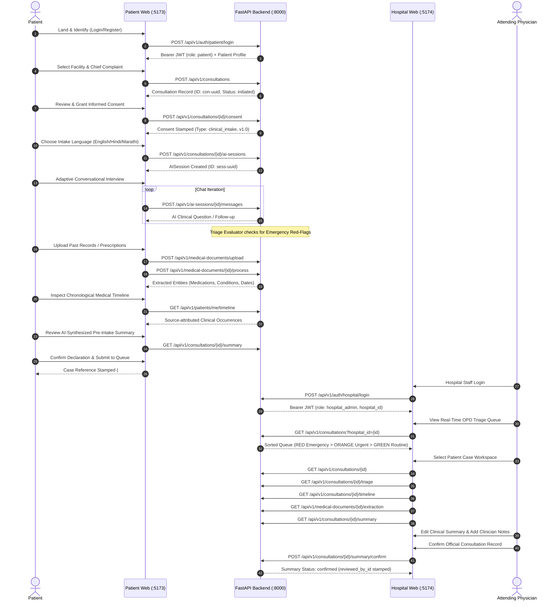

# Clinova SIH End-to-End Integration & System Architecture Specification

## 1. Executive Summary & Problem Context
In standard Indian Outpatient Departments (OPD), physicians face staggering patient loads (often seeing 60–100 patients in a 3-to-4 hour window, averaging under 2–3 minutes per consultation). Patients arrive with fragmented paper records, unorganized prescriptions, and unstructured verbal histories, leading to rushed examinations, missing drug-allergy data, and delayed triage of high-risk conditions.

**Clinova** resolves this operational bottleneck with an **unbroken, physician-supervised clinical workflow**:
1. **Patient Portal (`:5173`)**: Patient-friendly pre-intake (identification, consent, multi-lingual adaptive interview, document OCR, consolidated medical timeline, and draft summary review).
2. **FastAPI Backend (`:8000`)**: Resilient, deterministic red-flag triage, multi-provider AI engine (Gemini primary with Groq/OpenRouter/Ollama fallback), and secure PostgreSQL clinical store.
3. **Hospital Web Portal (`:5174`)**: High-efficiency OPD triage queue, real-time priority sorting, and an interactive Physician Case Workspace with side-by-side history, timeline, source-attributed OCR documents, and editable summary confirmation.

---

## 2. Unbroken End-to-End Workflow Trace

---

## 3. Comprehensive API Contract Traceability Matrix

| Flow Stage | HTTP Route | Caller Role | Request Body / Query Params | Response Structure | Failure Modes |
| :--- | :--- | :--- | :--- | :--- | :--- |
| **Auth** | `POST /api/v1/auth/patient/register` | Public | `PatientRegisterRequest` (name, phone, email, dob, gender, abha, password) | `CurrentUserResponse` (user, patient) | 400 (Collision on email/phone/ABHA) |
| **Auth** | `POST /api/v1/auth/patient/login` | Public | `LoginRequest` (identifier, password) | `TokenResponse` (token, user, patient) | 401 (Bad credentials), 403 (Inactive) |
| **Auth** | `POST /api/v1/auth/hospital/login` | Public | `LoginRequest` (identifier, password) | `TokenResponse` (token, user, hospital, role) | 401 (Invalid creds / unassociated) |
| **Facility** | `GET /api/v1/hospitals` | Authenticated | `skip`, `limit` | `list[HospitalSummaryResponse]` | 401 (Unauthenticated) |
| **Consultation**| `POST /api/v1/consultations` | Patient | `ConsultationCreate` (hospital_id, chief_complaint) | `ConsultationResponse` (id, status: initiated) | 400 (Hospital not found) |
| **Consent** | `POST /api/v1/consultations/{id}/consent` | Patient | `ConsentRecordRequest` (consent_given: true, type) | `ConsentRecordResponse` (granted, timestamp) | 404 (Not owned) |
| **AI Session** | `POST /api/v1/consultations/{id}/ai-sessions` | Patient | `AISessionCreate` (language: English/Hindi/Marathi) | `AISessionResponse` (id, status: initiated) | 404 (Consultation not found) |
| **AI Dialog** | `POST /api/v1/ai-sessions/{id}/messages` | Patient | `AIMessageCreate` (message, message_type) | `AIMessageResponse` (id, sender, message) | 404 (Session not found) |
| **Triage** | `GET /api/v1/consultations/{id}/triage` | Patient / Staff | Path: `consultation_id` | `TriageResult` (priority, is_red_flag, findings) | 404 (Unauthorized consultation) |
| **Triage** | `GET /api/v1/consultations/{id}/alerts` | Patient / Staff | Path: `consultation_id` | `AlertListResponse` (items, total) | 404 (Unauthorized consultation) |
| **Docs** | `POST /api/v1/medical-documents/upload` | Patient | `multipart/form-data` (file, consultation_id) | `MedicalDocumentResponse` (id, file_url) | 400 (Invalid type / >15MB) |
| **OCR** | `POST /api/v1/medical-documents/{id}/process` | Patient | Path: `id` | `ExtractedDataResponse` (raw_text, extracted_json) | 404 (Document not found) |
| **Timeline** | `GET /api/v1/patients/me/timeline` | Patient | None | `TimelineResponse` (events: list[TimelineEvent]) | 401 (Unauthenticated) |
| **Timeline** | `GET /api/v1/consultations/{id}/timeline` | Hospital Staff | Path: `consultation_id` | `TimelineResponse` (events: list[TimelineEvent]) | 404 (Hospital mismatch) |
| **Summary** | `GET /api/v1/consultations/{id}/summary` | Patient / Staff | Path: `consultation_id` | `ClinicalSummaryResponse` (status: draft/confirmed) | 404 (Not found) |
| **Summary** | `POST /api/v1/consultations/{id}/summary/generate` | Patient / Staff | Path: `consultation_id` | `ClinicalSummaryResponse` (synthesized summary) | 500 (AI generation failure) |
| **Summary** | `POST /api/v1/consultations/{id}/summary/confirm` | Hospital Staff | `SummaryConfirmRequest` (edited_text, notes) | `ClinicalSummaryResponse` (status: confirmed) | 403 (Non-hospital caller) |
| **Summary** | `POST /api/v1/consultations/{id}/summary/reject` | Hospital Staff | `SummaryRejectRequest` (rejection_reason) | `ClinicalSummaryResponse` (status: rejected) | 403 (Non-hospital caller) |

---

## 4. Dual-Portal Role Isolation & Security Architecture

### Role-Based Access Control (RBAC) Claims
All JWT access tokens are cryptographically signed using HS256 with strict expiration (`ACCESS_TOKEN_EXPIRE_MINUTES=30`):
- **Patient Token**: Contains `{"sub": "<user_uuid>", "role": "patient", "user_type": "patient"}`.
- **Hospital Token**: Contains `{"sub": "<user_uuid>", "role": "hospital_admin" | "doctor" | "hospital_staff", "user_type": "hospital", "hospital_id": "<hospital_uuid>"}`.

### Strict Multi-Tenant Isolation
1. **Patient Data Protection**: Patients are strictly constrained to records where `consultation.patient_id == current_user.patient.id`. Any attempt by Patient X to access Patient Y's consultation or triage returns `404 Not Found` (never leaking existence).
2. **Hospital Facility Scoping**: Hospital clinicians and administrators can only query consultations assigned to their facility (`consultation.hospital_id == current_user.hospital_id`).
3. **Write Permission Separation**:
   - Only patients can record consent and send messages in their active AI interview sessions.
   - Only licensed hospital staff can invoke `/summary/confirm` or `/summary/reject` to stamp legal clinical oversight.

---

## 5. Red-Flag Triage & Safety Architecture

### Deterministic Safety Core
Clinova follows the non-negotiable safety principle: **AI suggests; deterministic logic guarantees; physicians decide.**
- **Deterministic Rules are Authoritative**: The rule-based keyword/regex detector identifies life-threatening phrases (e.g., crushing retrosternal chest pain, radiating pain to left arm/jaw, acute diaphoresis, severe hemoptysis, sudden neurological deficits).
- **No LLM Downgrade**: If an LLM returns a lower urgency for a recognized red-flag pattern, deterministic rules strictly override the LLM finding.
- **Emergency UI Overlays**:
  - In the Patient Portal, a prominent red-alert modal immediately prompts the patient: *"Potential Emergency Detected. Please notify OPD nursing staff immediately."*
  - In the Hospital Portal, emergency cases are automatically sorted to the very top of the queue with an animated red pulse badge, ensuring zero delay in triage.

---

## 6. Mock Data Elimination Verification

In Step 10D, mock and hardcoded artifacts in the critical path were audited and eliminated:
1. **Patient Portal Summary Submission**:
   - Replaced static placeholder token (`#24`, "Estimated wait: ~15 mins") with live consultation reference ID derived from `currentConsultation.id.slice(0, 8).toUpperCase()`.
   - Dynamic hospital affiliation displayed on intake receipt card.
2. **Hospital Portal Queue**:
   - Driven entirely by live backend pagination query `GET /api/v1/consultations?hospital_id={id}`.
   - Real-time priority badge mappings (`emergency` -> Red, `urgent` -> Orange, `routine` -> Green).
3. **Physician Case Workspace**:
   - Complete live data binding across all tabs: Clinical Timeline, Extracted OCR Documents, AI History Dialogue, and Clinical Summary.
   - Full physician edit capability with immediate persistence via `POST /api/v1/consultations/{id}/summary/confirm`.

---

## 7. Privacy, Logging, & Auditability Guardrails
- **No Plaintext Credential Exposure**: Passwords hashed with salted bcrypt (72-byte truncation safe).
- **Log Sanitation**: Sensitive PII, full OCR document buffers, raw transcripts, and authentication credentials are strictly excluded from debug/production logging.
- **ABDM-Ready Architecture**: Data structures conform to National Health Authority (NHA) ABDM FHIR R4 profile conventions (demographic fields, consent timestamps, LOINC/SNOMED-compatible timeline types).
- **Clinical Audit Trail**: Every summary modification stores both `ai_draft_text` and `summary_text`, alongside `reviewed_by_id`, `reviewed_at`, and `clinician_notes` for tamper-evident medical-legal compliance.
