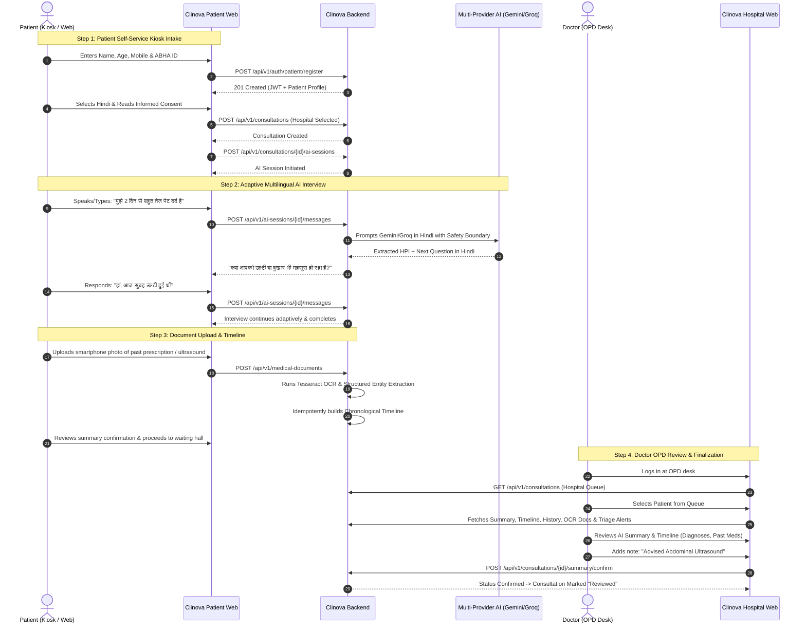
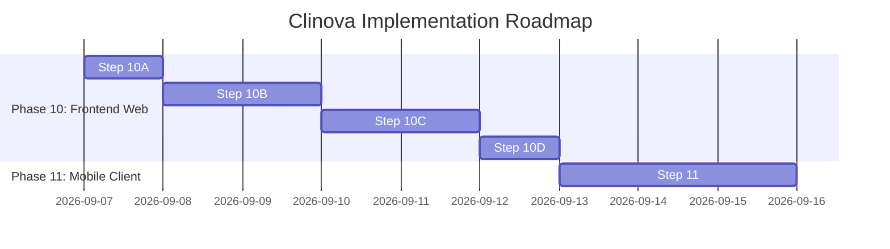

# Clinova SIH MVP Feature Freeze & Frontend/Backend Integration Audit

**Document Version:** 1.0.0  
**Status:** FROZEN  
**Target Milestone:** Smart India Hackathon (SIH) MVP  
**Scope:** Step 10A Audit & Freeze (Prerequisite for Step 10B / 10C / 10D / Step 11)  
**Date:** September 2026  

---

## 1. Executive Summary & Audit Objective

The primary objective of **Step 10A** is to establish a rigorous, evidence-based feature freeze for the **Clinova** platform prior to commencing full frontend implementation. 

Clinova is an **AI-powered digital patient case-taking and pre-consultation platform designed specifically to alleviate the severe clinical history-taking bottleneck in high-volume Indian Outpatient Departments (OPDs)**.

```
                    ┌─────────────────────────────────────────┐
                    │             CLINOVA BACKEND             │
                    │   (FastAPI + PostgreSQL + Multi-LLM)    │
                    └────────────────────┬────────────────────┘
                                         │
                 ┌───────────────────────┼───────────────────────┐
                 │                       │                       │
                 ▼                       ▼                       ▼
      ┌─────────────────────┐ ┌─────────────────────┐ ┌─────────────────────┐
      │  PATIENT WEB KIOSK  │ │  HOSPITAL DASHBOARD │ │   PATIENT MOBILE    │
      │    (Step 10B MVP)   │ │    (Step 10C MVP)   │ │     (Step 11)       │
      └─────────────────────┘ └─────────────────────┘ └─────────────────────┘
```

The backend represents the completed and validated source of truth across Milestones 1 through 9 (285 automated integration tests passing). Concurrently, a frontend UI prototype exists (`C:\Users\Amar\OneDrive\Desktop\clinova\frontend`) containing various screens, mockup interactions, and speculative API assumptions.

This audit:
1. Performs a comprehensive cross-examination of existing frontend designs versus backend capabilities.
2. Classifies every screen, action, and element into a standardized taxonomy.
3. Defines a lean, frozen SIH MVP scope centered purely on the OPD history-taking bottleneck.
4. Produces the definitive API mapping contract between frontend and backend.
5. Identifies the minimal backend gaps required before frontend execution.
6. Defines the critical demo path and execution order for Steps 10B, 10C, 10D, and 11.

---

## 2. Current Backend Capability Map (Steps 1–9)

The Clinova backend is structured into clear domain modules, backed by PostgreSQL, SQLAlchemy 2.0 Async, Pydantic v2 schemas, and a provider-independent AI engine.

| Milestone | Capability Domain | Implemented Endpoints & Services | Security / Clinical Guardrails |
| :--- | :--- | :--- | :--- |
| **Step 1** | **Authentication & RBAC** | `POST /api/v1/auth/patient/register`<br>`POST /api/v1/auth/patient/login`<br>`POST /api/v1/auth/hospital/register`<br>`POST /api/v1/auth/hospital/login`<br>`GET /api/v1/auth/me`<br>`POST /api/v1/auth/logout` | Bcrypt / Argon2id hashing, HMAC-SHA256 stateless JWT tokens. Role isolation (`PATIENT` vs `HOSPITAL`). No password hash leaks. |
| **Step 2** | **Patient Profile & Consultations** | `GET /api/v1/patients/me`<br>`PUT /api/v1/patients/me`<br>`POST /api/v1/consultations`<br>`GET /api/v1/consultations`<br>`GET /api/v1/consultations/{id}` | JWT-derived patient ID (no tampering). Cross-patient access returns `404`. Consultation lifecycle tracking (`initiated` → `reviewed`). |
| **Step 3** | **Clinical History Foundation** | `POST /api/v1/consultations/{id}/history`<br>`GET /api/v1/consultations/{id}/history`<br>`PUT /api/v1/consultations/{id}/history` | 1:1 consultation-history constraint. Standard 9 clinical sections: Chief Complaint, HPI, Past Medical, Past Surgical, Drug, Allergy, Family, Personal, ROS. |
| **Step 4** | **AI Sessions & Messages** | `POST /api/v1/consultations/{id}/ai-sessions`<br>`GET /api/v1/ai-sessions/{id}`<br>`POST /api/v1/ai-sessions/{id}/complete`<br>`POST /api/v1/ai-sessions/{id}/messages`<br>`GET /api/v1/ai-sessions/{id}/messages` | Session state machine (`initiated` → `in_progress` → `completed`). Anti-spoofing (`sender="patient"` enforced server-side). Chronological pagination. |
| **Step 5A** | **Multi-Provider AI Architecture** | `AITaskRouter`<br>`AIProvider` abstraction (`Gemini`, `OpenAI`, `Groq`, `OpenRouter`, `Ollama`) | Provider independence via environment configuration. Graceful fallback chain with Ollama as bounded local fallback. Missing API keys do not crash startup. |
| **Step 5B** | **Adaptive AI Clinical Interview** | Integrated in `POST /api/v1/ai-sessions/{id}/messages` | **Assistive only, strictly non-diagnostic**. Bounded context window. Structured LLM parsing (`AIInterviewMessageResponse`). Multilingual prompting (English, Hindi, Marathi). |
| **Step 6** | **Red-Flag Detection & Triage** | `GET /api/v1/consultations/{id}/triage`<br>`GET /api/v1/consultations/{id}/alerts` | 9 high-risk clinical categories. Deterministic rule engine overrides AI. In emergency, AI message replaced by calm safety notice. Alerts persisted in `alerts` table. |
| **Step 7** | **Medical Document Processing** | `POST /api/v1/medical-documents`<br>`GET /api/v1/medical-documents`<br>`GET /api/v1/medical-documents/{id}`<br>`GET /api/v1/medical-documents/{id}/file`<br>`POST /api/v1/medical-documents/{id}/process`<br>`GET /api/v1/medical-documents/{id}/extraction` | PDF & image upload (max 10MB). Path traversal defense. Tesseract OCR + pypdf text extraction. Multi-provider AI structured clinical extraction. Original file preserved. |
| **Step 8** | **Medical Timeline** | `GET /api/v1/patients/me/timeline`<br>`POST /api/v1/patients/me/timeline/rebuild`<br>`GET /api/v1/consultations/{id}/timeline`<br>`GET /api/v1/patients/{id}/timeline` | Cross-source aggregation (History + AI Interview + Documents + Consultations). Strict date precision (EXACT, MONTH, YEAR, APPROXIMATE, UNKNOWN). Idempotent rebuild. |
| **Step 9** | **Clinical Summary & Physician Review** | `POST /api/v1/consultations/{id}/summary/generate`<br>`GET /api/v1/consultations/{id}/summary`<br>`PUT /api/v1/consultations/{id}/summary`<br>`POST /api/v1/consultations/{id}/summary/confirm`<br>`POST /api/v1/consultations/{id}/summary/reject` | AI drafts, licensed physician decides. Clinician notes & draft edits tracked (preserves `ai_draft_text`). Finalization advances consultation to `reviewed`. Full audit logging. |

---

## 3. Frontend Design Inspection & Inventory

Inspection of the existing design files in `C:\Users\Amar\OneDrive\Desktop\clinova\frontend` reveals a React 19 + Vite 8 application containing 10 distinct pages and 7 UI components.

### 3.1 Patient-Facing Screens (Kiosk / Web)

#### 1. Landing Page (`LandingPage.jsx`)
- **Visual Design:** Hero headline ("MediKiosk AI / Clinova AI"), "Start Patient Intake" primary CTA, "Doctor Login" secondary CTA, 5-step horizontal visual stepper, 6-card feature grid, footer with clinical safety disclaimer.
- **Backend Support:** `UI_ONLY` presentation. Routes trigger navigation to `/identify` or `/doctor/login`.
- **Classification:** `CORE` (Serves as the initial kiosk welcoming view).

#### 2. Patient Identification Page (`IdentifyPage.jsx`)
- **Visual Design:** Step 0 progress stepper, mock ABHA ID lookup input with loading state and auto-fill simulation, form fields (Full Name, Age, Gender, Mobile Number), "Continue to Consent" CTA.
- **Speculative API Assumption:** Called `/api/patients/mock-abha/verify` and `/api/patients`.
- **Backend Reality:** Backend uses `POST /api/v1/auth/patient/register` or `POST /api/v1/auth/patient/login`. `abha_id` is an optional demographic attribute on `Patient`.
- **Classification:** `CORE` (Patient identification is required).

#### 3. Informed Consent Page (`ConsentPage.jsx`)
- **Visual Design:** Step 1 progress stepper, 5-point plain-language informed consent cards (AI Interview, Medical Summary, Data Security, Non-Diagnostic Disclaimer, Right to Withdraw), orange warning callout, interactive consent agreement checkbox, Back and Continue buttons.
- **Speculative API Assumption:** Called `/api/consent`.
- **Backend Reality:** Database table `consents` exists in backend schema, but lacks a dedicated REST endpoint in `app/api/v1/endpoints/`.
- **Classification:** `CORE` (Informed consent is ethically and legally mandatory for medical AI intake).

#### 4. Language & Mode Selection Page (`LanguagePage.jsx`)
- **Visual Design:** Step 2 progress stepper, 6-language selection grid (English, Hindi, Marathi, Tamil, Telugu, Bengali), 2-card mode selector ("Modern Medicine" vs "AYUSH / Ayurvedic - Dashavidha Pariksha"), selection preview pill, "Start Interview" CTA.
- **Speculative API Assumption:** Called `/api/history/start`.
- **Backend Reality:** `AISession` supports `language` (English, Hindi, Marathi have dedicated prompts). Backend does NOT have an AYUSH schema or prompts.
- **Classification:** Language Selection: `CORE` (English, Hindi, Marathi). AYUSH Mode: `FUTURE_SCOPE` (Omit or hide for SIH MVP).

#### 5. AI Clinical Interview Page (`InterviewPage.jsx`)
- **Visual Design:** Step 3 progress stepper, active clinical section indicator, Web Speech API Text-to-Speech (TTS) audio toggle, chat stream (AI question bubbles with section tags, patient response bubbles), typing indicator, quick-response option pills, multi-line auto-resizing textarea, microphone voice input button (`VoiceInput.jsx` via Web Speech API STT), full-screen `<EmergencyOverlay>` triggered by red flags, completion message.
- **Speculative API Assumption:** Called `/api/history/answer` and `/api/history/complete/{token}`.
- **Backend Reality:** Handled by `POST /api/v1/consultations/{id}/ai-sessions` and `POST /api/v1/ai-sessions/{session_id}/messages`. The backend returns `AIInterviewMessageResponse` containing next question, current section, missing information, and completion status.
- **Classification:** `CORE` (Central to SIH problem statement).

#### 6. Previous Records Upload Page (`UploadPage.jsx`)
- **Visual Design:** Step 4 progress stepper, drag-and-drop file upload zone (PDF, PNG, JPG, max 10MB), uploaded file list with status icons (pending, uploading, processing, done, error), document extraction explainer, "Upload & Extract" CTA, "Skip - No Documents" CTA.
- **Speculative API Assumption:** Called `/api/documents/upload` and `/api/documents/process/{id}`.
- **Backend Reality:** Fully supported by `POST /api/v1/medical-documents` and `POST /api/v1/medical-documents/{id}/process`.
- **Classification:** `CORE` (Crucial for digitizing physical OPD records).

#### 7. Patient Summary & Completion Page (`SummaryPage.jsx`)
- **Visual Design:** Step 5 progress stepper, patient demographics card with "Ready for Doctor" badge, prominent non-diagnostic AI disclaimer banner, clinical summary display box, "What We've Recorded" review checklist, "I've Reviewed This - Proceed to Doctor" CTA, "Upload More Documents" back button.
- **Speculative API Assumption:** Called `/api/summary/{patientId}`.
- **Backend Reality:** Supported by `GET /api/v1/consultations/{id}/summary`.
- **Classification:** `CORE` (Provides patient transparency and concludes intake).

---

### 3.2 Hospital / Clinician Screens (Doctor Portal)

#### 8. Doctor Login Page (`DoctorLoginPage.jsx`)
- **Visual Design:** Blue clinical gradient backdrop, stethoscope logo, email/password inputs, password visibility toggle, pre-filled demo credentials banner, "Sign In" CTA.
- **Speculative API Assumption:** Called `/api/auth/login`.
- **Backend Reality:** Fully supported by `POST /api/v1/auth/hospital/login`.
- **Classification:** `CORE` (Restricts clinical data to authorized facility staff).

#### 9. Doctor OPD Dashboard (`DoctorDashboardPage.jsx`)
- **Visual Design:** Sticky hospital navbar with doctor profile & logout, prominent red Emergency Alert banner with "Review Now" button, 4 KPI stat cards (Patients Today, Waiting, Emergency, Completed), patient queue table with search bar and priority filter buttons (All, Red, Orange, Green), row clicks route to `/doctor/patient/:id`.
- **Speculative API Assumption:** Called `/api/emergency/alerts`, `/api/doctor/stats`, and `/api/doctor/patients`.
- **Backend Reality:** Hospital staff can access triage, timeline, and summaries per consultation, but a hospital-scoped consultation queue listing endpoint (`GET /api/v1/hospitals/me/consultations` or role-aware `GET /api/v1/consultations`) is currently missing.
- **Classification:** `CORE` (Doctors must have a queue view to select patients).

#### 10. Patient Clinical Detail Workspace (`PatientDetailPage.jsx`)
- **Visual Design:** Sticky clinical header with patient demographics and priority badge, red-flag alert box with symptom text, tab navigation with 4 tabs:
  1. *Clinical History Tab*: Structured display of Chief Complaint, HPI breakdown (Onset, Location, Duration, Character, Severity, etc.), Past Medical, Past Surgical, Medications (chips), Allergies (chips with warnings), Family, Personal, ROS, and AYUSH cards.
  2. *AI Summary Tab*: Narrative clinical summary with non-diagnostic disclaimer, "Edit Summary" button, editable textarea, Save/Cancel buttons.
  3. *Timeline Tab*: Chronological timeline tree with colored category dots (diagnoses, medications, lab results, clinical history), date labels, source tags.
  4. *Doctor Review Tab*: Action selector (Approve, Approve with Edits, Reject / Redo), Doctor Notes textarea, "Submit Review" CTA.
- **Speculative API Assumption:** Called `/api/doctor/patient/{id}`, `/api/summary/{id}`, `/api/timeline/{id}`, and `/api/doctor/review`.
- **Backend Reality:**
  - Clinical History: `GET /api/v1/consultations/{id}/history`
  - Timeline: `GET /api/v1/consultations/{id}/timeline`
  - AI Summary & Review: `GET /api/v1/consultations/{id}/summary`, `PUT /api/v1/consultations/{id}/summary` (edit), `POST /api/v1/consultations/{id}/summary/confirm` (approve), `POST /api/v1/consultations/{id}/summary/reject` (reject).
- **Classification:** `CORE` (The doctor review workflow completes the SIH value proposition).

---

## 4. Comprehensive Feature Inventory & Classification

Every meaningful feature and screen identified across the design and backend is classified according to the six standard categories:
- `FULLY_SUPPORTED`: Existing backend API and models match requirement.
- `PARTIALLY_SUPPORTED`: Feature exists in backend but needs minor contract alignment or parameter adjustment.
- `BACKEND_MISSING`: Feature is vital for SIH MVP but lacks an existing backend endpoint.
- `UI_ONLY`: Client-side visual presentation; requires no backend persistence.
- `FUTURE_SCOPE`: Valid feature postponed until after SIH MVP.
- `NOT_REQUIRED_FOR_SIH`: Out of scope for the problem statement.

### Complete Feature Audit Matrix

| # | Interface | Screen / Page | Feature / Action | Backend Support Classification | Exact Backend API / Method | Auth Required | User Role | SIH Priority | Decision |
|---|---|---|---|---|---|---|---|---|---|
| 1 | Patient Web | Landing | Kiosk Welcome Screen | `UI_ONLY` | None (Static) | None | Anonymous | Core | Build |
| 2 | Patient Web | Landing | "Start Intake" Navigation | `UI_ONLY` | Client routing (`/identify`) | None | Anonymous | Core | Build |
| 3 | Patient Web | Landing | "Doctor Login" Navigation | `UI_ONLY` | Client routing (`/doctor/login`) | None | Anonymous | Core | Build |
| 4 | Patient Web | Identify | ABHA ID Entry & Format Check | `UI_ONLY` | Client validation regex | None | Anonymous | Core | Build |
| 5 | Patient Web | Identify | Live ABDM Health Record Fetch | `FUTURE_SCOPE` | None (No live ABDM bridge) | N/A | N/A | Low | Omit |
| 6 | Patient Web | Identify | Patient Registration / Identification | `FULLY_SUPPORTED` | `POST /api/v1/auth/patient/register` | None | Anonymous | Core | Build |
| 7 | Patient Web | Identify | Patient Login | `FULLY_SUPPORTED` | `POST /api/v1/auth/patient/login` | None | Anonymous | Core | Build |
| 8 | Patient Web | Identify | Fetch Authenticated Profile | `FULLY_SUPPORTED` | `GET /api/v1/patients/me` | Bearer JWT | Patient | Core | Build |
| 9 | Patient Web | Identify | Hospital Facility Selection | `BACKEND_MISSING` | Suggested: `GET /api/v1/hospitals/active` | None / JWT | Patient | Core | Build Gap |
| 10 | Patient Web | Consent | Kiosk Informed Consent View | `UI_ONLY` | Static presentation | Bearer JWT | Patient | Core | Build |
| 11 | Patient Web | Consent | Record Patient Consent | `BACKEND_MISSING` | Model exists (`consents`), lacks endpoint | Bearer JWT | Patient | Core | Build Gap / Client State |
| 12 | Patient Web | Language | Select Language (EN, HI, MR) | `FULLY_SUPPORTED` | Stored in `AISession.language` | Bearer JWT | Patient | Core | Build |
| 13 | Patient Web | Language | Select Language (TA, TE, BN) | `PARTIALLY_SUPPORTED` | Zero-shot LLM fallback | Bearer JWT | Patient | Optional | Retain in UI |
| 14 | Patient Web | Language | AYUSH / Ayurvedic Intake Mode | `FUTURE_SCOPE` | None (No AYUSH schemas) | Bearer JWT | Patient | Low | Omit / Hide |
| 15 | Patient Web | Consultation | Create Consultation Encounter | `FULLY_SUPPORTED` | `POST /api/v1/consultations` | Bearer JWT | Patient | Core | Build |
| 16 | Patient Web | Interview | Start AI Interview Session | `FULLY_SUPPORTED` | `POST /api/v1/consultations/{id}/ai-sessions` | Bearer JWT | Patient | Core | Build |
| 17 | Patient Web | Interview | Send Patient Response | `FULLY_SUPPORTED` | `POST /api/v1/ai-sessions/{id}/messages` | Bearer JWT | Patient | Core | Build |
| 18 | Patient Web | Interview | Adaptive Follow-Up Question | `FULLY_SUPPORTED` | Returned in `AIInterviewMessageResponse` | Bearer JWT | Patient | Core | Build |
| 19 | Patient Web | Interview | Voice Speech-to-Text (STT) | `UI_ONLY` | Browser `SpeechRecognition` API | None | Patient | Core | Build (Native) |
| 20 | Patient Web | Interview | Voice Text-to-Speech (TTS) | `UI_ONLY` | Browser `speechSynthesis` API | None | Patient | Core | Build (Native) |
| 21 | Patient Web | Interview | Quick Option Pills | `UI_ONLY` | Client parsing of AI suggestions | None | Patient | Core | Build |
| 22 | Patient Web | Interview | Red-Flag Emergency Overlay | `FULLY_SUPPORTED` | Triggered by `emergency_safety_notice` | Bearer JWT | Patient | Core | Build |
| 23 | Patient Web | Interview | Complete Interview Session | `FULLY_SUPPORTED` | `POST /api/v1/ai-sessions/{id}/complete` | Bearer JWT | Patient | Core | Build |
| 24 | Patient Web | Upload | Upload PDF / Image Report | `FULLY_SUPPORTED` | `POST /api/v1/medical-documents` | Bearer JWT | Patient | Core | Build |
| 25 | Patient Web | Upload | OCR & Structured AI Extraction | `FULLY_SUPPORTED` | `POST /api/v1/medical-documents/{id}/process` | Bearer JWT | Patient | Core | Build |
| 26 | Patient Web | Upload | Skip Document Upload | `UI_ONLY` | Client navigation to `/summary` | None | Patient | Core | Build |
| 27 | Patient Web | Summary | View Patient AI Summary | `FULLY_SUPPORTED` | `GET /api/v1/consultations/{id}/summary` | Bearer JWT | Patient | Core | Build |
| 28 | Patient Web | Summary | Non-Diagnostic Disclaimer | `UI_ONLY` | Static banner | None | Patient | Core | Build |
| 29 | Patient Web | Summary | Finish Intake & Reset Kiosk | `UI_ONLY` | Client state reset & timer redirect | None | Patient | Core | Build |
| 30 | Hospital Web | Login | Hospital Staff / Doctor Login | `FULLY_SUPPORTED` | `POST /api/v1/auth/hospital/login` | None | Anonymous | Core | Build |
| 31 | Hospital Web | Login | Current User Context | `FULLY_SUPPORTED` | `GET /api/v1/auth/me` | Bearer JWT | Hospital Staff | Core | Build |
| 32 | Hospital Web | Dashboard | Facility OPD Consultation Queue | `BACKEND_MISSING` | Need `GET /api/v1/hospitals/me/consultations` | Bearer JWT | Hospital Staff | Core | Build Gap |
| 33 | Hospital Web | Dashboard | Hospital KPI Stat Cards | `BACKEND_MISSING` | Suggested: derive on client or add stats | Bearer JWT | Hospital Staff | Secondary | Client Derive |
| 34 | Hospital Web | Dashboard | Facility Emergency Alert Banner | `PARTIALLY_SUPPORTED` | Query alerts across consultations | Bearer JWT | Hospital Staff | Core | Build Gap |
| 35 | Hospital Web | Patient Detail | View Patient Demographics | `FULLY_SUPPORTED` | `GET /api/v1/consultations/{id}` | Bearer JWT | Hospital Staff | Core | Build |
| 36 | Hospital Web | Patient Detail | View Structured Clinical History | `FULLY_SUPPORTED` | `GET /api/v1/consultations/{id}/history` | Bearer JWT | Hospital Staff | Core | Build |
| 37 | Hospital Web | Patient Detail | View Red-Flag Triage Findings | `FULLY_SUPPORTED` | `GET /api/v1/consultations/{id}/triage` | Bearer JWT | Hospital Staff | Core | Build |
| 38 | Hospital Web | Patient Detail | View Medical Timeline | `FULLY_SUPPORTED` | `GET /api/v1/consultations/{id}/timeline` | Bearer JWT | Hospital Staff | Core | Build |
| 39 | Hospital Web | Patient Detail | View Extracted Medical Documents | `FULLY_SUPPORTED` | `GET /api/v1/medical-documents?consultation_id={id}` | Bearer JWT | Hospital Staff | Core | Build |
| 40 | Hospital Web | Patient Detail | Download Original Medical File | `FULLY_SUPPORTED` | `GET /api/v1/medical-documents/{id}/file` | Bearer JWT | Hospital Staff | Core | Build |
| 41 | Hospital Web | Patient Detail | View AI Clinical Summary Draft | `FULLY_SUPPORTED` | `GET /api/v1/consultations/{id}/summary` | Bearer JWT | Hospital Staff | Core | Build |
| 42 | Hospital Web | Patient Detail | Clinician Edit Summary Narrative | `FULLY_SUPPORTED` | `PUT /api/v1/consultations/{id}/summary` | Bearer JWT | Hospital Staff | Core | Build |
| 43 | Hospital Web | Patient Detail | Physician Confirm & Finalize | `FULLY_SUPPORTED` | `POST /api/v1/consultations/{id}/summary/confirm` | Bearer JWT | Doctor / Staff | Core | Build |
| 44 | Hospital Web | Patient Detail | Physician Reject Summary Draft | `FULLY_SUPPORTED` | `POST /api/v1/consultations/{id}/summary/reject` | Bearer JWT | Doctor / Staff | Core | Build |
| 45 | Platform | Telemedicine | Live Video Consultation | `FUTURE_SCOPE` | None | N/A | N/A | Low | Omit |
| 46 | Platform | Payments | Online Consultation Payment Gateway | `NOT_REQUIRED_FOR_SIH` | None | N/A | N/A | Zero | Omit |
| 47 | Platform | Pharmacy | Drug Ordering / Prescription Dispatch | `FUTURE_SCOPE` | None | N/A | N/A | Low | Omit |
| 48 | Platform | Insurance | TPA / Insurance Claim Workflow | `NOT_REQUIRED_FOR_SIH` | None | N/A | N/A | Zero | Omit |
| 49 | Platform | Wellness | Step Counter / Fitness Tracking | `NOT_REQUIRED_FOR_SIH` | None | N/A | N/A | Zero | Omit |

---

## 5. SIH Problem Statement Alignment

The SIH problem statement addresses **OPD overcrowding and clinical history-taking delays in Indian public and private healthcare facilities**. In a typical Indian hospital OPD, a doctor spends less than 3 to 5 minutes per patient. A significant portion of this time is consumed asking basic demographic questions, deciphering old paper reports, translating complaints across languages, and typing or scribbling history into an EMR.

### What Clinova Solves (In-Scope SIH Core):
1. **Queue Bottleneck Reduction:** Patient completes automated pre-consultation on a web kiosk or mobile device while waiting in the OPD waiting hall.
2. **Multilingual Inclusivity:** Patient interacts in their native language (Hindi, Marathi, or English) via voice or text.
3. **Clinical Safety Net:** Immediate deterministic triage identifies life-threatening red flags (chest pain, stroke symptoms, respiratory distress) before the patient reaches the doctor.
4. **Digitization of Paper Bag Records:** Historical paper prescriptions and lab reports are photographed/scanned, OCR'd, and chronologically mapped on a timeline.
5. **Physician Empowerment:** When the patient enters the consultation room, the doctor opens a synthesized, evidence-backed clinical summary, reviews the findings, edits if necessary, and finalizes with one click.

### What Clinova Avoids (Out-of-Scope Distractions):
- Commercial e-commerce features (payments, drug ordering, insurance).
- Telehealth video calls (this is an in-person OPD pre-intake solution).
- Unverified diagnostic AI claims (Clinova is strictly non-diagnostic; it extracts and synthesizes facts).
- Full ABDM health information exchange certification (prototype uses ABHA for identification only).

---

## 6. Frontend/Backend Exact API Mapping Contract

This section defines the exact, verified HTTP route mappings for every CORE feature.

```
================================================================================
                      PATIENT WEB KIOSK API MAPPING
================================================================================

1. Patient Authentication
   POST /api/v1/auth/patient/register
   Headers: Content-Type: application/json
   Payload: {
     "email": "ramesh@example.com",          // optional if phone provided
     "phone": "+919876543210",              // optional if email provided
     "password": "Password123!",
     "full_name": "Ramesh Kumar",
     "date_of_birth": "1988-04-12",
     "gender": "male",
     "abha_id": "14-1234-5678-9012"         // optional
   }
   Response: 201 Created -> { user: {...}, patient: {...} }

   POST /api/v1/auth/patient/login
   Payload: { "identifier": "+919876543210", "password": "Password123!" }
   Response: 200 OK -> { access_token, token_type: "bearer", patient: {...} }

2. Patient Profile
   GET /api/v1/patients/me
   Headers: Authorization: Bearer <patient_token>
   Response: 200 OK -> PatientProfileResponse

3. Create Consultation (Encounter Initiation)
   POST /api/v1/consultations
   Headers: Authorization: Bearer <patient_token>
   Payload: {
     "hospital_id": "<hospital_uuid>",
     "chief_complaint": "Severe stomach pain since yesterday"
   }
   Response: 201 Created -> ConsultationResponse { id: "<consultation_uuid>", ... }

4. AI Clinical Interview Session
   POST /api/v1/consultations/{consultation_id}/ai-sessions
   Headers: Authorization: Bearer <patient_token>
   Payload: { "language": "Hindi" }         // English | Hindi | Marathi
   Response: 201 Created -> AISessionResponse { id: "<session_uuid>", ... }

5. Send Patient Message & Receive Adaptive Question
   POST /api/v1/ai-sessions/{session_id}/messages
   Headers: Authorization: Bearer <patient_token>
   Payload: { "message": "It started after dinner and feels like burning" }
   Response: 201 Created -> AIInterviewMessageResponse {
     ai_message: { message: "Are you also experiencing nausea or vomiting?" },
     interview: {
       next_question: "Are you also experiencing nausea or vomiting?",
       current_section: "history_of_present_illness",
       interview_complete: false,
       missing_information: ["nausea", "fever"]
     },
     clinical_history_updates: { "history_of_present_illness": "..." }
   }

6. Check Triage Status & Red-Flag Alerts
   GET /api/v1/consultations/{consultation_id}/triage
   Headers: Authorization: Bearer <patient_token>
   Response: 200 OK -> TriageResult { urgency, has_red_flags, findings, safety_notice }

   GET /api/v1/consultations/{consultation_id}/alerts
   Headers: Authorization: Bearer <patient_token>
   Response: 200 OK -> AlertListResponse { items: [...] }

7. Conclude Interview
   POST /api/v1/ai-sessions/{session_id}/complete
   Headers: Authorization: Bearer <patient_token>
   Response: 200 OK -> AISessionResponse { status: "completed", ... }

8. Upload Previous Medical Document
   POST /api/v1/medical-documents
   Headers: Authorization: Bearer <patient_token>, Content-Type: multipart/form-data
   Form Fields:
     - file: <binary>
     - document_type: "lab_report" | "prescription" | "discharge_summary" | "other"
     - consultation_id: "<consultation_uuid>"
     - process_immediately: true
   Response: 201 Created -> MedicalDocumentResponse { id: "<doc_uuid>", processing_status: "completed" }

9. Fetch Structured Extraction & Timeline
   GET /api/v1/medical-documents/{document_id}/extraction
   GET /api/v1/patients/me/timeline
   Response: 200 OK -> PatientTimelineResponse { events: [...] }

10. View Patient Clinical Summary
    GET /api/v1/consultations/{consultation_id}/summary
    Headers: Authorization: Bearer <patient_token>
    Response: 200 OK -> SummaryResponse { summary_text, status: "draft", ... }

================================================================================
                    HOSPITAL / DOCTOR DASHBOARD API MAPPING
================================================================================

1. Hospital Authentication
   POST /api/v1/auth/hospital/login
   Payload: { "identifier": "doctor@apollohospital.org", "password": "Password123!" }
   Response: 200 OK -> { access_token, user: {...}, hospital: {...}, hospital_role: "doctor" }

2. Facility Consultation Queue (Gap to add in 10C / backend)
   GET /api/v1/consultations?status=initiated
   Headers: Authorization: Bearer <hospital_token>
   Response: 200 OK -> ConsultationListResponse { items: [...] }

3. Patient Case Workspace
   GET /api/v1/consultations/{consultation_id}
   Headers: Authorization: Bearer <hospital_token>
   Response: 200 OK -> ConsultationResponse

   GET /api/v1/consultations/{consultation_id}/history
   Response: 200 OK -> ClinicalHistoryResponse { chief_complaint, hpi, past_medical_history, ... }

   GET /api/v1/consultations/{consultation_id}/triage
   Response: 200 OK -> TriageResult { urgency, has_red_flags, findings }

   GET /api/v1/consultations/{consultation_id}/timeline
   Response: 200 OK -> PatientTimelineResponse { events: [...] }

   GET /api/v1/medical-documents?consultation_id={consultation_id}
   Response: 200 OK -> MedicalDocumentListResponse { items: [...] }

   GET /api/v1/medical-documents/{document_id}/file
   Response: 200 OK -> Stream original PDF / image

4. Review, Edit & Finalize Clinical Summary
   GET /api/v1/consultations/{consultation_id}/summary
   Response: 200 OK -> SummaryResponse { id, summary_text, status, ... }

   PUT /api/v1/consultations/{consultation_id}/summary
   Headers: Authorization: Bearer <hospital_token>
   Payload: {
     "summary_text": "Updated clinical summary narrative...",
     "clinician_notes": "Patient advised routine ultrasound."
   }
   Response: 200 OK -> SummaryResponse { version: 2, ... }

   POST /api/v1/consultations/{consultation_id}/summary/confirm
   Headers: Authorization: Bearer <hospital_token>
   Payload: { "clinician_notes": "Reviewed and verified." }
   Response: 200 OK -> SummaryResponse { status: "confirmed" }
   // Advances consultation status to 'reviewed' and promotes timeline events to CLINICIAN_VERIFIED.

   POST /api/v1/consultations/{consultation_id}/summary/reject
   Headers: Authorization: Bearer <hospital_token>
   Payload: { "rejection_reason": "Incomplete symptoms recorded." }
   Response: 200 OK -> SummaryResponse { status: "rejected" }
```

---

## 7. Backend Gaps Required Before Frontend Implementation

The backend is exceptionally mature, but two specific API contracts require immediate attention to enable seamless frontend integration without brittle workarounds.

### Gap 1: Hospital-Scoped Consultation Queue Listing
- **Problem:** Currently, `GET /api/v1/consultations` is locked strictly to `CurrentPatientDep` (patients listing their own consultations). A doctor or hospital administrator logging into Hospital Web has no endpoint to fetch the list of consultations for their hospital.
- **Solution:** Allow `GET /api/v1/consultations` to be accessible by `CurrentUserDep`. If the user is a `Patient`, return patient's consultations. If the user is a `HospitalUser`, return consultations where `consultation.hospital_id == hospital_user.hospital_id` with optional filtering by `status` (`initiated`, `reviewed`, etc.).
- **Priority:** `CRITICAL (P0)` for Hospital Web (Step 10C).

### Gap 2: Public Hospital Directory Endpoint
- **Problem:** When a patient creates a consultation via `POST /api/v1/consultations`, the schema requires `hospital_id: uuid.UUID`. Currently, there is no public endpoint to list active hospitals (`GET /api/v1/hospitals`), meaning the patient kiosk cannot populate a hospital selector dropdown.
- **Solution:** Provide `GET /api/v1/hospitals` returning public metadata (`id`, `name`, `city`, `state`).
- **Priority:** `HIGH (P1)` for Patient Web (Step 10B).

### Gap 3: Explicit Consent Recording Endpoint
- **Problem:** Database table `consents` exists, but there is no endpoint under `app/api/v1/endpoints/`.
- **Solution:** Add `POST /api/v1/consultations/{consultation_id}/consent` persisting consent record (`granted=true`, `consent_type="clinical_intake"`, `timestamp=now()`).
- **Priority:** `MEDIUM (P2)` (For MVP frontend, consent state can be held in React Context or saved via this lightweight endpoint).

---

## 8. ABDM / ABHA Scope Boundary

```
┌─────────────────────────────────────────────────────────────┐
│                    ABDM / ABHA BOUNDARY                     │
├──────────────────────────────┬──────────────────────────────┤
│       IN-SCOPE (MVP)         │    OUT-OF-SCOPE (FUTURE)     │
├──────────────────────────────┼──────────────────────────────┤
│ • ABHA ID patient entry      │ • Live ABDM M1/M2/M3 APIs    │
│ • Demographic auto-fill hint │ • Live OTP verification SMS  │
│ • Stored in patient profile  │ • ABDM Consent Manager link  │
│ • ABHA identifier login      │ • HIP / HIU network bridge   │
│ • Printed on summary header  │ • External FHIR record pull  │
└──────────────────────────────┴──────────────────────────────┘
```

**Rule for SIH Prototype:** The prototype uses ABHA strictly as an Indian national health identifier and demographic reference. Do NOT attempt to integrate mock ABDM gateway servers or claim live government gateway connectivity.

---

## 9. End-to-End SIH MVP Demo Journey

The entire SIH presentation will be demonstrated through one coherent, realistic clinical scenario:



---

## 10. Final Frozen MVP Screen List

### A. Patient Web (Kiosk / Mobile Browser) — Step 10B
1. **Required (Frozen Core):**
   - `LandingPage`: Hospital Kiosk entry point with "Start Intake" CTA.
   - `IdentifyPage`: Quick patient registration / login with Name, Age, Gender, Mobile, ABHA ID.
   - `ConsentPage`: Clear informed consent checklist with non-diagnostic disclaimer.
   - `LanguagePage`: Selection between English, Hindi, Marathi.
   - `InterviewPage`: Conversational AI intake, Web Speech STT/TTS, red-flag emergency overlay.
   - `UploadPage`: PDF/JPG document upload, OCR processing status, skip button.
   - `SummaryPage`: Patient intake completion summary with "Proceed to Waiting Hall" CTA.
2. **Optional:**
   - Tamil/Telugu/Bengali language options (if time permits).
3. **Future / Excluded:**
   - AYUSH / Ayurvedic intake mode.
   - Telemedicine video interface.
   - Payment gateway.

### B. Hospital Web (Doctor Portal) — Step 10C
1. **Required (Frozen Core):**
   - `DoctorLoginPage`: Secure facility staff authentication.
   - `DoctorDashboardPage`: OPD patient queue table with search, priority badges (Red, Orange, Green), and emergency alert banner.
   - `PatientDetailPage`:
     - *Tab 1: Clinical History*: Formatted chief complaint, HPI, past history, medications, allergies.
     - *Tab 2: AI Clinical Summary*: Structured draft with clinician edit mode and notes input.
     - *Tab 3: Chronological Timeline*: Visual timeline of past events and document extractions.
     - *Tab 4: Review & Finalization*: Approve, Approve with Edits, or Reject with rationale.
2. **Optional:**
   - KPI Stat Cards (derived directly on frontend from queue data).
3. **Future / Excluded:**
   - Bed management / inpatient wards.
   - Pharmacy stock & billing.
   - Electronic prescription generator.

### C. Patient Mobile App (React Native / Expo) — Step 11
1. **Required (Frozen Core for Step 11):**
   - Mobile Login / Register with SecureStore token persistence.
   - Patient Profile view.
   - Start consultation.
   - Mobile-optimized AI chat with native microphone input.
   - Camera report scanner / upload.
   - Personal medical timeline view.
2. **Future / Excluded:**
   - Full hospital administrative dashboard on mobile.

---

## 11. Design vs. Backend Mismatch Report

| Screen / Feature in Design | Present in Design? | Present in Backend? | Current Status | Decision |
|---|---|---|---|---|
| **Patient Identification** | Yes (`IdentifyPage.jsx`) | Yes (`/api/v1/auth/patient/register`) | `FULLY_SUPPORTED` | **Build in 10B** |
| **ABHA ID Lookup** | Yes (`IdentifyPage.jsx`) | Demographic field only | `PARTIALLY_SUPPORTED` | **Use as identifier; no fake gateway** |
| **Informed Consent** | Yes (`ConsentPage.jsx`) | DB Table exists, no REST route | `BACKEND_MISSING` | **Add route / retain in client context** |
| **Language Selection** | Yes (`LanguagePage.jsx`) | Yes (EN, HI, MR) | `FULLY_SUPPORTED` | **Build EN, HI, MR** |
| **AYUSH Intake Mode** | Yes (`LanguagePage.jsx`) | No schema or prompts | `FUTURE_SCOPE` | **Hide / Omit for SIH MVP** |
| **Voice Input (STT/TTS)** | Yes (`VoiceInput.jsx`) | Native Browser API | `UI_ONLY` | **Build with Web Speech API** |
| **AI Clinical Interview** | Yes (`InterviewPage.jsx`) | Yes (`ai-sessions` + `messages`) | `FULLY_SUPPORTED` | **Build in 10B** |
| **Red-Flag Overlay** | Yes (`EmergencyOverlay.jsx`) | Yes (`triage` + safety notices) | `FULLY_SUPPORTED` | **Build in 10B** |
| **Document Upload & OCR** | Yes (`UploadPage.jsx`) | Yes (`medical-documents`) | `FULLY_SUPPORTED` | **Build in 10B** |
| **Patient Summary** | Yes (`SummaryPage.jsx`) | Yes (`consultations/{id}/summary`) | `FULLY_SUPPORTED` | **Build in 10B** |
| **Doctor Login** | Yes (`DoctorLoginPage.jsx`) | Yes (`/api/v1/auth/hospital/login`) | `FULLY_SUPPORTED` | **Build in 10C** |
| **Hospital OPD Queue** | Yes (`DoctorDashboardPage.jsx`) | Patient-only endpoint currently | `BACKEND_MISSING` | **Add hospital query capability** |
| **Emergency Alerts Banner** | Yes (`DoctorDashboardPage.jsx`) | Per-consultation alerts exist | `PARTIALLY_SUPPORTED` | **Query active consultation alerts** |
| **Doctor Review Tabs** | Yes (`PatientDetailPage.jsx`) | Yes (`history`, `summary`, `timeline`) | `FULLY_SUPPORTED` | **Build in 10C** |
| **Summary Edit & Finalize** | Yes (`PatientDetailPage.jsx`) | Yes (`PUT summary`, `confirm`, `reject`) | `FULLY_SUPPORTED` | **Build in 10C** |
| **Live Telehealth Video** | No / Speculative | No | `FUTURE_SCOPE` | **Omit** |
| **Online Payments** | No / Speculative | No | `NOT_REQUIRED_FOR_SIH` | **Omit** |

---

## 12. Non-Functional UI / UX Requirements for SIH Demo

1. **Deterministic Loading States:**
   - Skeleton screens or spinner indicators during AI question generation, document OCR extraction, and summary compilation.
2. **Network & Error Resilience:**
   - If an AI provider experiences a transient timeout, the UI must display a calm retry notification without crashing or clearing patient input.
3. **Touch-Screen / Kiosk Ergonomics:**
   - Minimum tap target size of 48px × 48px for all interactive buttons on the Patient Web portal.
4. **Visual Hierarchy & Typography:**
   - Clean, professional clinical typography (Inter / Roboto) with distinctive emergency visual callouts (`#dc2626` crimson for Red Flags; `#ea580c` for Urgent warnings; `#2563eb` for standard clinical actions).
5. **No Medical Jargon in Patient View:**
   - Kiosk screens must use simple, accessible terminology, whereas the Doctor Dashboard displays standard clinical terminology (HPI, ROS, ICD categories).

---

## 13. Sequential Implementation Roadmap (Steps 10B → 11)



### Detailed Execution Sequence:

1. **Step 10B — Patient Web Portal (`clients/patient-web`)**:
   - Initialize Vite + React + TypeScript in `clients/patient-web`.
   - Implement Axios API client configured for backend `/api/v1`.
   - Port and refine the 7 frozen screens (`LandingPage`, `IdentifyPage`, `ConsentPage`, `LanguagePage`, `InterviewPage`, `UploadPage`, `SummaryPage`).
   - Wire native Web Speech STT and TTS.
   - Connect real backend APIs for patient registration, consultation creation, AI interview messages, document upload, OCR extraction, and patient summary.

2. **Step 10C — Hospital Web Dashboard (`clients/hospital-web`)**:
   - Initialize Vite + React + TypeScript in `clients/hospital-web`.
   - Port and refine the 3 doctor screens (`DoctorLoginPage`, `DoctorDashboardPage`, `PatientDetailPage`).
   - Resolve the two minimal backend gaps (`GET /api/v1/consultations` for hospital role and `GET /api/v1/hospitals`).
   - Wire Doctor Review actions: edit draft, confirm & finalize, reject with reason.

3. **Step 10D — End-to-End Integration & Demo Hardening**:
   - Run complete end-to-end user journeys from Patient Kiosk to Doctor Finalization on live local servers.
   - Verify non-diagnostic safety boundaries and audit logs.
   - Provide synthetic demo fixtures for reproducible SIH presentation.

4. **Step 11 — Patient Mobile App (`clients/patient-mobile`)**:
   - Build React Native + Expo client with camera capture, native voice, and timeline inspection.

---
**Audit Approved & Scope Frozen for Step 10B.**
