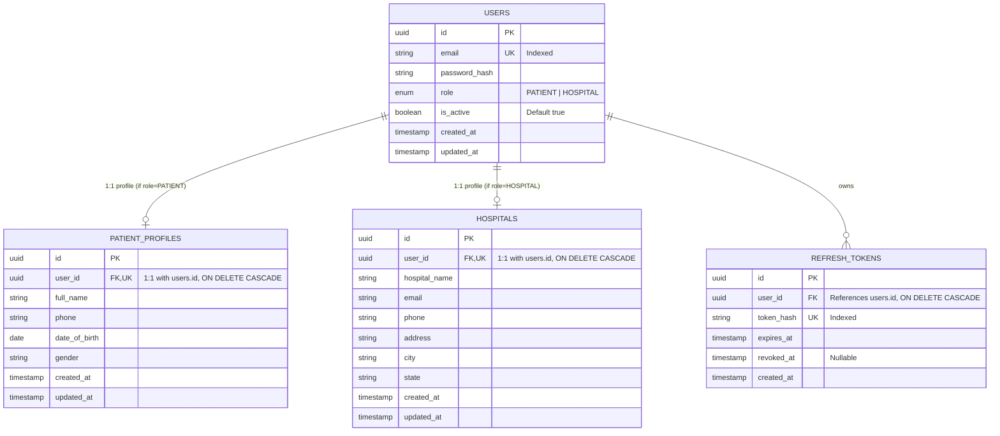

# Clinova Platform: Phase 1 Foundation & Authentication Architecture

## 1. Executive Summary & Strict Phase 1 Scope

**Clinova** is a multi-client healthcare platform connecting patients and hospital administrative entities through dedicated web and mobile interfaces powered by a central **FastAPI** backend and **PostgreSQL** database.

### Strict Phase 1 Boundaries:
The Phase 1 scope is strictly constrained to **core system foundation and role-based authentication**. No secondary clinical workflows or future modules are included at this stage.

| Domain | In-Scope (Phase 1 Only) | Out-of-Scope (Postponed to Future Phases) |
| :--- | :--- | :--- |
| **Patient** | Registration, Login, Logout, View/Update basic profile, Protected Patient home view | Medical history, vitals, prescriptions, appointment booking, lab records |
| **Hospital** | Registration, Login, Logout, View/Update basic facility profile, Protected Hospital dashboard | Doctors, staff management, departments, bed allocation, patient queues |
| **Platforms** | Patient Web, Patient Mobile (Expo), Hospital Web, Central FastAPI API, PostgreSQL | Microservices, standalone AI engines, background Celery workers, Redis |
| **Database** | 4 Tables: `users`, `patient_profiles`, `hospitals`, `refresh_tokens` | Appointments, consultations, audit logs, vector tables (`pgvector`), FHIR |
| **Security** | JWT auth, token rotation, `pwdlib[argon2]` hashing, RBAC (`PATIENT` vs `HOSPITAL`) | Biometric auth, external identity providers (OAuth/SAML), ABDM bridge |

---

## 2. Monorepo Directory Structure

The project uses a structured, clean monorepo architecture separating the backend service, three independent frontend client applications, and shared documentation.

```
Clinova-sih/
├── .github/
│   └── workflows/                       # Path-filtered CI workflows (linting, tests, build checks)
├── backend/
│   ├── app/
│   │   ├── api/
│   │   │   ├── v1/
│   │   │   │   ├── endpoints/
│   │   │   │   │   ├── auth.py          # /auth/patient/register, /auth/hospital/register, /auth/login, /auth/refresh, /auth/logout
│   │   │   │   │   ├── patients.py      # /patients/me (profile get & update)
│   │   │   │   │   └── hospitals.py     # /hospitals/me (profile get & update)
│   │   │   │   └── router.py            # Aggregates v1 endpoints
│   │   │   └── deps.py                  # Dependencies: get_async_db, get_current_user, require_role
│   │   ├── core/
│   │   │   ├── config.py                # Pydantic Settings (ENV variables, DB connection, JWT secrets)
│   │   │   ├── security.py              # Argon2 password hashing (via pwdlib), JWT encode/decode
│   │   │   └── exceptions.py            # Custom HTTP exceptions and global handlers
│   │   ├── db/
│   │   │   ├── base.py                  # SQLAlchemy DeclarativeBase and metadata registry
│   │   │   └── session.py               # Async engine (create_async_engine) & async_sessionmaker
│   │   ├── models/                      # SQLAlchemy 2.0 Async ORM models
│   │   │   ├── __init__.py              # Central imports for Alembic autogenerate discovery
│   │   │   ├── user.py                  # User table (auth credentials + UserRole enum)
│   │   │   ├── patient.py               # PatientProfile table (demographics)
│   │   │   ├── hospital.py              # Hospital table (facility profile)
│   │   │   └── refresh_token.py         # RefreshToken table (token tracking & revocation)
│   │   ├── schemas/                     # Pydantic v2 validation & response DTOs
│   │   │   ├── __init__.py
│   │   │   ├── auth.py                  # LoginRequest, TokenResponse, RefreshRequest
│   │   │   ├── user.py                  # UserBase, UserOut, UserRoleEnum
│   │   │   ├── patient.py               # PatientRegisterRequest, PatientProfileOut, PatientProfileUpdate
│   │   │   └── hospital.py              # HospitalRegisterRequest, HospitalProfileOut, HospitalProfileUpdate
│   │   ├── services/                    # Business logic layer (decoupled from HTTP routes)
│   │   │   ├── auth_service.py          # Registration, credential validation, JWT minting & revocation
│   │   │   ├── patient_service.py       # Patient profile CRUD logic
│   │   │   └── hospital_service.py      # Hospital profile CRUD logic
│   │   └── main.py                      # FastAPI app factory, CORS middleware, lifespan events
│   ├── alembic/                         # Database schema migrations
│   │   ├── versions/
│   │   └── env.py                       # Configured for async migration execution
│   ├── alembic.ini
│   ├── pyproject.toml / requirements.txt
│   ├── .env.example
│   └── tests/
│       ├── conftest.py                  # Test fixtures & test DB session setup
│       ├── test_auth.py                 # Registration, login, refresh, logout tests
│       └── test_profiles.py             # Profile retrieval, updates, and RBAC rejection tests
├── clients/
│   ├── patient-web/                     # React + TypeScript + Vite (Patient Portal)
│   │   ├── public/
│   │   ├── src/
│   │   │   ├── assets/
│   │   │   ├── components/              # Layout, Navbar, ProtectedRoute, Input, Button, Card
│   │   │   ├── context/                 # AuthContext (lightweight auth session state)
│   │   │   ├── pages/                   # LoginPage, RegisterPage, HomePage, ProfilePage
│   │   │   ├── services/                # Axios API client with token refresh interceptor
│   │   │   ├── types/                   # TypeScript interfaces (User, PatientProfile, AuthTokens)
│   │   │   ├── App.tsx
│   │   │   ├── main.tsx
│   │   │   └── index.css                # Vanilla CSS design tokens (Calm Medical Blue/Slate)
│   │   ├── package.json
│   │   ├── tsconfig.json
│   │   └── vite.config.ts
│   │
│   ├── hospital-web/                    # React + TypeScript + Vite (Hospital Admin Dashboard)
│   │   ├── public/
│   │   ├── src/
│   │   │   ├── assets/
│   │   │   ├── components/              # Sidebar, ProtectedRoute, DashboardHeader, FacilityCard
│   │   │   ├── context/                 # AuthContext (Hospital auth session state & role gate)
│   │   │   ├── pages/                   # LoginPage, RegisterPage, DashboardHomePage, FacilityProfilePage
│   │   │   ├── services/                # Axios API client with token interceptor
│   │   │   ├── types/                   # TypeScript interfaces (User, Hospital, AuthTokens)
│   │   │   ├── App.tsx
│   │   │   ├── main.tsx
│   │   │   └── index.css                # Vanilla CSS design tokens (Clinical Teal/Navy/Slate)
│   │   ├── package.json
│   │   ├── tsconfig.json
│   │   └── vite.config.ts
│   │
│   └── patient-mobile/                  # React Native + Expo + TypeScript (Patient Mobile App)
│       ├── assets/
│       ├── src/
│       │   ├── components/              # Button, Input, Card, Header, LoadingSpinner
│       │   ├── context/                 # AuthContext backed by expo-secure-store
│       │   ├── navigation/              # React Navigation (AuthStack, AppStack, BottomTabs)
│       │   ├── screens/                 # LoginScreen, RegisterScreen, HomeScreen, ProfileScreen
│       │   ├── services/                # API client with dynamic host resolution (LAN / Emulator)
│       │   ├── types/                   # TypeScript models
│       │   └── utils/                   # Secure storage helpers
│       ├── App.tsx
│       ├── app.json
│       ├── package.json
│       └── tsconfig.json
├── docs/                                # Setup guides & architecture documentation
├── .gitignore
└── README.md
```

---

## 3. Database Architecture & Initial Schema (Phase 1)

The persistence layer uses **PostgreSQL** with **SQLAlchemy 2.0 Async (`asyncpg`)** and **Alembic** migrations.

### Entity Relationship Model



### Table Specifications:

1. **`users`**:
   - `id`: UUID (Primary Key, auto-generated default `uuid7` or `uuid4`)
   - `email`: VARCHAR(255), Unique, Not Null, Indexed
   - `password_hash`: VARCHAR(255), Not Null (Argon2id hash string)
   - `role`: VARCHAR(20), Not Null (`PATIENT` or `HOSPITAL`)
   - `is_active`: BOOLEAN, Default `True`, Not Null
   - `created_at`: TIMESTAMPTZ, Default `now()`, Not Null
   - `updated_at`: TIMESTAMPTZ, Default `now()`, OnUpdate `now()`, Not Null

2. **`patient_profiles`**:
   - `id`: UUID (Primary Key)
   - `user_id`: UUID, Unique, Foreign Key (`users.id`, `ON DELETE CASCADE`), Not Null
   - `full_name`: VARCHAR(150), Not Null
   - `phone`: VARCHAR(25), Nullable
   - `date_of_birth`: DATE, Nullable
   - `gender`: VARCHAR(20), Nullable
   - `created_at`: TIMESTAMPTZ, Default `now()`, Not Null
   - `updated_at`: TIMESTAMPTZ, Default `now()`, OnUpdate `now()`, Not Null

3. **`hospitals`**:
   - `id`: UUID (Primary Key)
   - `user_id`: UUID, Unique, Foreign Key (`users.id`, `ON DELETE CASCADE`), Not Null
   - `hospital_name`: VARCHAR(200), Not Null
   - `email`: VARCHAR(255), Nullable
   - `phone`: VARCHAR(25), Nullable
   - `address`: TEXT, Nullable
   - `city`: VARCHAR(100), Nullable
   - `state`: VARCHAR(100), Nullable
   - `created_at`: TIMESTAMPTZ, Default `now()`, Not Null
   - `updated_at`: TIMESTAMPTZ, Default `now()`, OnUpdate `now()`, Not Null

4. **`refresh_tokens`**:
   - `id`: UUID (Primary Key)
   - `user_id`: UUID, Foreign Key (`users.id`, `ON DELETE CASCADE`), Not Null
   - `token_hash`: VARCHAR(255), Unique, Not Null, Indexed
   - `expires_at`: TIMESTAMPTZ, Not Null
   - `revoked_at`: TIMESTAMPTZ, Nullable (NULL = Active; Non-null = Revoked)
   - `created_at`: TIMESTAMPTZ, Default `now()`, Not Null

---

## 4. Backend Architecture & Authentication Pipeline

The backend implements a decoupled, testable **Layered Async Architecture**:

```
[ HTTP Requests from Web & Mobile ]
                 │
                 ▼
┌─────────────────────────────────────────────────────────────┐
│  FastAPI Application & Middlewares                          │
│  - CORS Middleware (origins: localhost:5173, 5174, etc.)    │
│  - Global Exception Handlers (Standard Error Envelopes)     │
│  - Pydantic v2 Request Validation & Response Serialization   │
└──────────────────────────────┬──────────────────────────────┘
                               │
                               ▼
┌─────────────────────────────────────────────────────────────┐
│  Dependency Injection Layer (app/api/deps.py)               │
│  - get_async_db: Scoped AsyncSession generator              │
│  - get_current_user: JWT validation & user extraction       │
│  - require_role: Higher-order RBAC dependency               │
│    (e.g., require_role(UserRole.PATIENT))                   │
└──────────────────────────────┬──────────────────────────────┘
                               │
                               ▼
┌─────────────────────────────────────────────────────────────┐
│  Service Layer (app/services/)                              │
│  - AuthService: Registration, password verification,        │
│    JWT pair generation, refresh token rotation & revocation │
│  - PatientService: Patient profile retrieval & update       │
│  - HospitalService: Hospital profile retrieval & update     │
└──────────────────────────────┬──────────────────────────────┘
                               │
                               ▼
┌─────────────────────────────────────────────────────────────┐
│  Data Layer (SQLAlchemy 2.0 Async + asyncpg)                │
│  - AsyncSession transactions (commit / rollback)            │
│  - Mapped declarative models                                │
└──────────────────────────────┬──────────────────────────────┘
                               │
                               ▼
┌─────────────────────────────────────────────────────────────┐
│  PostgreSQL 18 Database Engine                              │
└─────────────────────────────────────────────────────────────┘
```

### Security & Cryptographic Decisions:
1. **Password Hashing**: Implemented via `pwdlib[argon2]` using Argon2id algorithm. No legacy `passlib` or deprecated `crypt` bindings are used, ensuring 100% compatibility with modern Python runtimes (Python 3.13 / 3.14).
2. **JWT Structure**:
   - **Access Token**: Short-lived (15–30 minutes). Payload claims: `sub` (user_id), `role` (`PATIENT` or `HOSPITAL`), `exp`, `iat`, `type="access"`.
   - **Refresh Token**: Long-lived (7 days). Secure cryptographically random string or UUID; its SHA-256 hash is persisted in `refresh_tokens`.
3. **Token Rotation & Invalidation**:
   - On `/auth/refresh`, the old refresh token is marked with `revoked_at = now()` and a new token pair is minted.
   - On `/auth/logout`, the refresh token is immediately marked `revoked_at = now()`.

---

## 5. API Endpoints & Request/Response Contracts

All API endpoints reside under `/api/v1`:

### 1. Authentication Endpoints (`/api/v1/auth`)

| Endpoint | Method | Role Required | Request Body | Response | Description |
| :--- | :--- | :--- | :--- | :--- | :--- |
| `/auth/patient/register` | `POST` | Public | `PatientRegisterRequest` (`email`, `password`, `full_name`, `phone`, `date_of_birth`, `gender`) | `201 Created` (`user_id`, `email`, `role`, `profile`) | Registers a new patient user + patient profile in one atomic transaction. |
| `/auth/hospital/register` | `POST` | Public | `HospitalRegisterRequest` (`email`, `password`, `hospital_name`, `phone`, `address`, `city`, `state`) | `201 Created` (`user_id`, `email`, `role`, `hospital`) | Registers a new hospital user + hospital profile in one atomic transaction. |
| `/auth/login` | `POST` | Public | `LoginRequest` (`email`, `password`) | `200 OK` (`access_token`, `refresh_token`, `token_type`, `user`: `{id, email, role}`) | Validates credentials; returns JWT token pair & user info. |
| `/auth/refresh` | `POST` | Public | `RefreshRequest` (`refresh_token`) | `200 OK` (`access_token`, `refresh_token`, `token_type`) | Rotates tokens; revokes old refresh token and issues new pair. |
| `/auth/logout` | `POST` | Authenticated | `RefreshRequest` (`refresh_token`) | `200 OK` (`{"detail": "Logged out successfully"}`) | Revokes the refresh token in the database. |

### 2. Patient Profile Endpoints (`/api/v1/patients`)

| Endpoint | Method | Role Required | Request Body | Response | Description |
| :--- | :--- | :--- | :--- | :--- | :--- |
| `/patients/me` | `GET` | `PATIENT` | None | `200 OK` (`PatientProfileOut`) | Returns the authenticated patient's profile details. |
| `/patients/me` | `PUT` | `PATIENT` | `PatientProfileUpdate` | `200 OK` (`PatientProfileOut`) | Updates the authenticated patient's profile details. |

### 3. Hospital Profile Endpoints (`/api/v1/hospitals`)

| Endpoint | Method | Role Required | Request Body | Response | Description |
| :--- | :--- | :--- | :--- | :--- | :--- |
| `/hospitals/me` | `GET` | `HOSPITAL` | None | `200 OK` (`HospitalProfileOut`) | Returns the authenticated hospital's profile details. |
| `/hospitals/me` | `PUT` | `HOSPITAL` | `HospitalProfileUpdate` | `200 OK` (`HospitalProfileOut`) | Updates the authenticated hospital's profile details. |

---

## 6. Frontend Client Architectures

### 1. Patient Web Application (`clients/patient-web`)
- **Framework**: React + TypeScript + Vite.
- **Server State Management**: `@tanstack/react-query` (TanStack Query) for efficient caching, query invalidation, and data fetching of profile data.
- **Authentication State**: Simple React Context (`AuthContext`) managing current user object, access token, and login/logout state.
- **Routing**: `react-router-dom` with `ProtectedRoute` component restricting access to authenticated users with `role === "PATIENT"`.
- **UI Design System**: Vanilla CSS tokens with modern CSS variables (Calm Medical Palette: slate, oceanic blue, soft emerald, clean typography).

### 2. Hospital Web Application (`clients/hospital-web`)
- **Framework**: React + TypeScript + Vite.
- **Server State Management**: `@tanstack/react-query` for hospital profile queries and mutations.
- **Authentication State**: Simple React Context (`AuthContext`) enforcing `role === "HOSPITAL"`.
- **Routing**: `react-router-dom` with `ProtectedRoute` preventing access from non-hospital or unauthenticated users.
- **UI Design System**: Vanilla CSS tokens tailored for administrative clinical dashboards (Slate, teal, navy, glassmorphic card containers).

### 3. Patient Mobile Application (`clients/patient-mobile`)
- **Framework**: React Native + Expo + TypeScript.
- **Navigation**: `@react-navigation/native` with `@react-navigation/native-stack` (`AuthStack` for Login/Register, `AppStack` with Bottom Tabs for Home and Profile).
- **Secure Token Storage**: `expo-secure-store` for hardware-backed encryption (iOS Keychain / Android Keystore) for storing the JWT access and refresh tokens.
- **Dynamic Host Discovery**: Dynamic API base URL configuration module using `Constants.expoConfig?.hostUri` / environment variable to automatically route to local machine LAN IP, Android Emulator (`10.0.2.2`), or iOS Simulator (`localhost`).

---

## 7. Technology Stack & Dependencies Matrix

### Backend Dependencies (`backend/requirements.txt`)
- `fastapi>=0.115.0`: ASGI Web framework for building APIs.
- `uvicorn[standard]>=0.32.0`: High-performance ASGI web server.
- `sqlalchemy>=2.0.35`: Modern async declarative SQL toolkit and ORM.
- `asyncpg>=0.30.0`: High-speed asynchronous PostgreSQL database client.
- `alembic>=1.13.3`: Database schema migration tool.
- `pydantic[email]>=2.9.0`: Data parsing and validation with email string validation.
- `pydantic-settings>=2.5.0`: Settings management from `.env` files.
- `pyjwt[crypto]>=2.9.0`: Secure JSON Web Token encoding and decoding.
- `pwdlib[argon2]>=0.2.1`: Modern password hashing with Argon2id algorithm.
- `python-multipart>=0.0.12`: Form data parsing.
- `pytest>=8.3.0`, `pytest-asyncio>=0.24.0`, `httpx>=0.27.0`: Async testing suite and HTTP test client.

### Patient Web & Hospital Web Dependencies (`clients/patient-web`, `clients/hospital-web`)
- `react`, `react-dom` (`^19.0.0` or `^18.3.1`)
- `typescript` (`^5.6.0`)
- `vite` (`^6.0.0`)
- `@tanstack/react-query` (`^5.60.0`): Server-state caching and synchronization.
- `react-router-dom` (`^7.0.0` or `^6.28.0`): Client-side routing.
- `axios` (`^1.7.0`): HTTP requests with token interceptors.
- `lucide-react`: Modern UI icon set.

### Patient Mobile Dependencies (`clients/patient-mobile`)
- `expo` (`~52.0.0`)
- `react-native`
- `typescript`
- `@tanstack/react-query` (`^5.60.0`)
- `@react-navigation/native`, `@react-navigation/native-stack`, `@react-navigation/bottom-tabs`
- `expo-secure-store`: Hardware-backed secure storage for credentials.
- `axios`: HTTP client.
- `@expo/vector-icons` or `lucide-react-native`.

---

## 8. Security, Validation & Role Separation Rules

1. **Password Safety**: Passwords are never stored in plaintext. They are hashed using Argon2id with automatic salt generation before persisting to PostgreSQL.
2. **Zero Password Hash Leakage**: Pydantic response models (`UserOut`, `TokenResponse`, `PatientProfileOut`, `HospitalProfileOut`) strictly omit `password_hash`.
3. **Environment Isolation**:
   - `.env` files and sensitive credentials are in `.gitignore`.
   - Backend loads secrets via `pydantic-settings` from environment variables.
   - `.env.example` templates contain only non-secret dummy defaults.
4. **Data Validation on Both Layers**:
   - Frontend validates email format, password complexity, and required fields before submission.
   - Backend re-validates all payloads strictly using Pydantic v2 schemas and database constraints.
5. **Strict RBAC & Route Isolation**:
   - Role claims (`role`) are cryptographically sealed in JWT payloads.
   - Backend dependency `require_role(allowed_roles)` rejects mismatched access with `403 Forbidden`.
   - Frontend `ProtectedRoute` redirects unauthorized roles (e.g., patient attempting to load hospital portal).
6. **No Medical Data in GitHub**:
   - Only structural schemas and seed scripts with synthetic test data are committed.

---

## 9. 13-Step Sequential Implementation Roadmap

```mermaid
gantt
    title Clinova Phase 1 Implementation Order
    dateFormat  X
    axisFormat  Step %s
    
    section Foundation & Database
    Step 1: Monorepo Structure Init           :active, s1, 0, 1
    Step 2: Backend Foundation & Config        :s2, after s1, 1
    Step 3: PostgreSQL Async Connection Setup  :s3, after s2, 1
    Step 4: SQLAlchemy 2.0 Async Models        :s4, after s3, 1
    Step 5: Alembic Migrations Init & Baseline :s5, after s4, 1
    
    section Backend Auth Services & APIs
    Step 6: Auth & Security Services (Argon2, JWT) :s6, after s5, 1
    Step 7: Patient Registration & Profile API     :s7, after s6, 1
    Step 8: Hospital Registration & Profile API    :s8, after s7, 1
    
    section Frontend Client Implementations
    Step 9: Patient Web Portal (Vite + React)      :s9, after s8, 1
    Step 10: Hospital Web Dashboard (Vite + React) :s10, after s9, 1
    Step 11: Patient Mobile App (Expo)             :s11, after s10, 1
    
    section Testing & Verification
    Step 12: End-to-End Integration Testing        :s12, after s11, 1
    Step 13: Documentation & Project Cleanup       :s13, after s12, 1
```

### Detailed Steps:

1. **Step 1: Monorepo Structure Setup**
   - Create root workspace configuration, `.gitignore`, `.editorconfig`, and directory structure (`backend/`, `clients/patient-web/`, `clients/hospital-web/`, `clients/patient-mobile/`, `docs/`).
2. **Step 2: Backend Foundation**
   - Create `backend/pyproject.toml` / `requirements.txt`.
   - Setup `backend/app/core/config.py` using `pydantic-settings`.
   - Setup `backend/app/main.py` with FastAPI app factory, CORS middleware, and root health check `/health`.
3. **Step 3: PostgreSQL Connection**
   - Configure async engine and session factory (`create_async_engine`, `async_sessionmaker`) in `backend/app/db/session.py`.
   - Implement `get_async_db` generator in `backend/app/api/deps.py`.
4. **Step 4: SQLAlchemy Models**
   - Implement declarative models in `backend/app/models/`:
     - `User` (`models/user.py`)
     - `PatientProfile` (`models/patient.py`)
     - `Hospital` (`models/hospital.py`)
     - `RefreshToken` (`models/refresh_token.py`)
5. **Step 5: Alembic Migrations**
   - Initialize Alembic with `alembic init -t async alembic`.
   - Configure `alembic/env.py` with SQLAlchemy async engine and declarative metadata.
   - Generate and apply initial migration `001_initial_phase1_auth.py`.
6. **Step 6: Authentication Services**
   - Implement password hashing with `pwdlib[argon2]` in `backend/app/core/security.py`.
   - Implement JWT token generation, signature verification, and decode helpers.
   - Implement `AuthService` in `backend/app/services/auth_service.py` (login, password verify, refresh token rotation, logout).
7. **Step 7: Patient Authentication & Profile API**
   - Implement Pydantic schemas in `backend/app/schemas/patient.py`.
   - Build `/api/v1/auth/patient/register` and `/api/v1/patients/me` (GET, PUT) endpoints with `require_role(UserRole.PATIENT)`.
8. **Step 8: Hospital Authentication & Profile API**
   - Implement Pydantic schemas in `backend/app/schemas/hospital.py`.
   - Build `/api/v1/auth/hospital/register` and `/api/v1/hospitals/me` (GET, PUT) endpoints with `require_role(UserRole.HOSPITAL)`.
9. **Step 9: Patient Web Application**
   - Scaffold `clients/patient-web` with Vite + React + TypeScript.
   - Setup Vanilla CSS design tokens (Calm Medical Blue/Slate).
   - Configure TanStack Query, AuthContext, Axios interceptors, and protected routes.
   - Implement Patient Register, Login, Protected Home, and Profile view/edit screens.
10. **Step 10: Hospital Web Application**
    - Scaffold `clients/hospital-web` with Vite + React + TypeScript.
    - Setup Vanilla CSS design tokens (Clinical Teal/Navy/Slate).
    - Configure TanStack Query, AuthContext, Axios interceptors, and protected routes.
    - Implement Hospital Register, Login, Protected Dashboard Home, and Facility Profile view/edit screens.
11. **Step 11: Patient Mobile Application**
    - Scaffold `clients/patient-mobile` with Expo + React Native + TypeScript.
    - Configure `@react-navigation`, `expo-secure-store`, and dynamic LAN/Emulator host resolver.
    - Implement Mobile Login, Register, Protected Home, and Profile screens.
12. **Step 12: Integration Testing & Verification**
    - Run automated backend async test suite (`pytest backend/tests/test_auth.py`, `pytest backend/tests/test_profiles.py`).
    - Verify role rejection (Hospital credentials rejected on Patient web/mobile; Patient credentials rejected on Hospital web).
    - Verify token refresh rotation and logout token invalidation.
13. **Step 13: Documentation & Cleanup**
    - Update root `README.md` and `docs/` with developer setup commands, environment variables reference, and run scripts.
