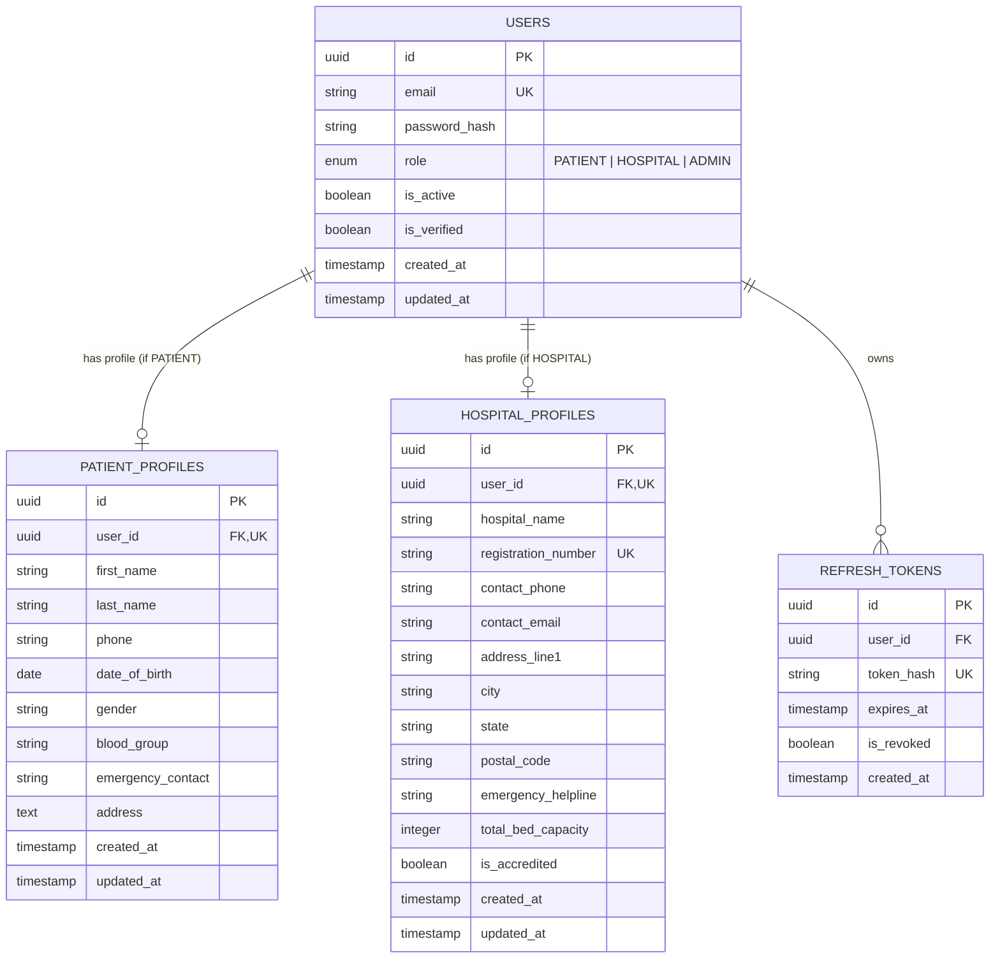
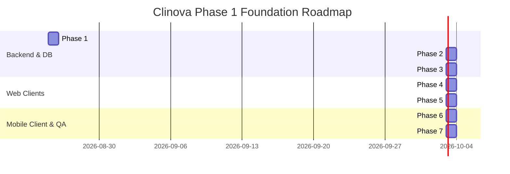

# Clinova Platform: Architectural Blueprint & Foundation Implementation Plan

## Executive Summary & Current Repository State

**Clinova** is a multi-client healthcare ecosystem designed to serve patients and hospital administrative/clinical staff through dedicated client applications backed by a centralized, secure Python FastAPI backend and a PostgreSQL database.

### Repository Inspection
- **Repository Path**: `c:\Clinova\Clinova-sih`
- **Remote Origin**: `https://github.com/harshalbari05/Clinova-sih`
- **Current State**: Initialized Git repository on `main` branch with 0 commits (empty workspace).
- **Environment & Toolchain**:
  - Python: `3.14.0`
  - Node.js: `v24.19.0` (npm `11.17.0`)
  - Git: `2.55.0`
  - Database: PostgreSQL 18 service (`postgresql-x64-18`) active locally on Windows (`C:\Program Files\PostgreSQL\18\bin`)

---

## 1. Directory Structure (Clean Monorepo Layout)

We propose a structured monorepo organization that separates client applications, backend services, database migrations, and shared documentation while maintaining clear boundary isolation and independent dependency management.

```
Clinova-sih/
├── .github/
│   └── workflows/              # CI/CD pipelines (linting, tests, build checks)
├── backend/
│   ├── app/
│   │   ├── api/
│   │   │   ├── v1/
│   │   │   │   ├── endpoints/
│   │   │   │   │   ├── auth.py          # /register, /login, /refresh, /logout
│   │   │   │   │   ├── patients.py      # /patients/me (profile get & update)
│   │   │   │   │   └── hospitals.py     # /hospitals/me (profile get & update)
│   │   │   │   └── router.py            # Aggregates v1 routes
│   │   │   └── deps.py                  # FastAPI dependency injection (get_db, get_current_user, require_role)
│   │   ├── core/
│   │   │   ├── config.py                # Pydantic Settings (ENV variables, DB URL, JWT secrets)
│   │   │   ├── security.py              # Password hashing (Argon2id/bcrypt), JWT encode/decode
│   │   │   └── exceptions.py            # Custom HTTP exceptions and global handlers
│   │   ├── db/
│   │   │   ├── base.py                  # Base declarative class and metadata registry
│   │   │   └── session.py               # SQLAlchemy engine & sessionmaker (scoped sessions)
│   │   ├── models/                      # SQLAlchemy ORM database models
│   │   │   ├── __init__.py              # Central imports for Alembic discovery
│   │   │   ├── user.py                  # User table (auth credentials + UserRole enum)
│   │   │   ├── patient.py               # PatientProfile table (demographics, contact)
│   │   │   ├── hospital.py              # HospitalProfile table (facility details, license)
│   │   │   └── token_blocklist.py       # Revoked tokens / active refresh sessions
│   │   ├── schemas/                     # Pydantic v2 validation & serialization models
│   │   │   ├── __init__.py
│   │   │   ├── auth.py                  # LoginRequest, RegisterRequest, TokenResponse, TokenPayload
│   │   │   ├── user.py                  # UserBase, UserOut, UserRoleEnum
│   │   │   ├── patient.py               # PatientRegister, PatientProfileOut, PatientProfileUpdate
│   │   │   └── hospital.py              # HospitalRegister, HospitalProfileOut, HospitalProfileUpdate
│   │   ├── services/                    # Business logic layer (decoupled from HTTP layer)
│   │   │   ├── auth_service.py          # User registration, verification, token minting & revocation
│   │   │   ├── patient_service.py       # Patient profile management logic
│   │   │   └── hospital_service.py      # Hospital profile management logic
│   │   └── main.py                      # FastAPI app factory, CORS middleware, lifespan events
│   ├── alembic/                         # Database schema migrations
│   │   ├── versions/
│   │   └── env.py
│   ├── alembic.ini
│   ├── pyproject.toml / requirements.txt
│   ├── .env.example
│   └── tests/
│       ├── conftest.py
│       ├── test_auth.py
│       └── test_profiles.py
├── clients/
│   ├── patient-web/                     # React + TypeScript + Vite (Patient Web Portal)
│   │   ├── public/
│   │   ├── src/
│   │   │   ├── assets/
│   │   │   ├── components/              # UI components (Navbar, ProtectedRoute, Forms, Layout)
│   │   │   ├── context/                 # AuthContext (token storage, login state, user info)
│   │   │   ├── pages/                   # LoginPage, RegisterPage, DashboardPage, ProfilePage
│   │   │   ├── services/                # Axios/Fetch API client with auth interceptor
│   │   │   ├── types/                   # TypeScript interfaces (User, PatientProfile, AuthTokens)
│   │   │   ├── App.tsx
│   │   │   ├── main.tsx
│   │   │   └── index.css
│   │   ├── package.json
│   │   ├── tsconfig.json
│   │   └── vite.config.ts
│   │
│   ├── hospital-web/                    # React + TypeScript + Vite (Hospital Admin Dashboard)
│   │   ├── public/
│   │   ├── src/
│   │   │   ├── assets/
│   │   │   ├── components/              # Sidebar, ProtectedRoute, MetricCards, DashboardHeader
│   │   │   ├── context/                 # AuthContext (Hospital auth state & role gate)
│   │   │   ├── pages/                   # LoginPage, RegisterPage, DashboardPage, FacilityProfilePage
│   │   │   ├── services/                # API client with token interceptor
│   │   │   ├── types/                   # TypeScript interfaces (HospitalProfile, User, Auth)
│   │   │   ├── App.tsx
│   │   │   ├── main.tsx
│   │   │   └── index.css
│   │   ├── package.json
│   │   ├── tsconfig.json
│   │   └── vite.config.ts
│   │
│   └── patient-mobile/                  # React Native + Expo + TypeScript (Patient Mobile App)
│       ├── assets/
│       ├── src/
│       │   ├── components/              # Button, Input, Card, Header, LoadingScreen
│       │   ├── context/                 # AuthContext backed by expo-secure-store
│       │   ├── navigation/              # React Navigation (AuthStack, AppStack, TabNavigator)
│       │   ├── screens/                 # LoginScreen, RegisterScreen, HomeScreen, ProfileScreen
│       │   ├── services/                # API client configured for Mobile (Localhost / LAN IP)
│       │   ├── types/                   # Shared TypeScript models
│       │   └── utils/                   # Secure storage helpers
│       ├── App.tsx
│       ├── app.json
│       ├── package.json
│       └── tsconfig.json
├── docs/                                # Architecture diagrams & setup guides
├── .gitignore
└── README.md
```

---

## 2. Responsibilities of Each Application

| Application | Technology | Primary Target Users | Responsibilities & Boundary |
| :--- | :--- | :--- | :--- |
| **Central Backend API** | Python, FastAPI, SQLAlchemy | All 3 Clients | Single source of truth. Handles business logic, role-based auth, password hashing, JWT creation/refresh/invalidation, data validation, database persistence, and RBAC enforcement. |
| **Patient Web Application** | React + TypeScript + Vite | Patients on Desktop/Web Browsers | Patient onboarding (registration), authentication, viewing & updating patient demographics/medical history baseline, responsive patient dashboard with token lifecycle management. |
| **Hospital Web Dashboard** | React + TypeScript + Vite | Hospital Admins, Clinicians, Staff | Hospital facility onboarding (registration with license/accreditation), secure dashboard access, facility profile management, staff role validation, audit-ready data display. |
| **Patient Mobile Application** | React Native + Expo + TypeScript | Patients on iOS / Android Devices | Native mobile patient experience. Secure credential and JWT persistence via hardware-backed SecureStore/Keychain, offline-safe state, biometric readiness, mobile-optimized auth and profile flows. |

---

## 3. Backend Architecture

The backend adheres to a **Layered & Clean Architecture** pattern:

```
[ HTTP Requests ]
       │
       ▼
┌────────────────────────────────────────────────────────┐
│  FastAPI Routing & Middleware Layer                    │
│  - CORS Middleware, Request ID, Exception Handlers     │
│  - Pydantic v2 Request Validation & Response Filtering │
└──────────────────────────┬─────────────────────────────┘
                           │
                           ▼
┌────────────────────────────────────────────────────────┐
│  Dependency Injection Layer (app/api/deps.py)          │
│  - Database session lifecycle (get_db)                 │
│  - Authentication guard (get_current_user)             │
│  - Role Guard (require_role: PATIENT | HOSPITAL)       │
└──────────────────────────┬─────────────────────────────┘
                           │
                           ▼
┌────────────────────────────────────────────────────────┐
│  Service / Business Logic Layer (app/services/)        │
│  - AuthService: verify credentials, hash passwords,    │
│    generate token pairs, revoke refresh tokens         │
│  - PatientService & HospitalService: profile crud      │
└──────────────────────────┬─────────────────────────────┘
                           │
                           ▼
┌────────────────────────────────────────────────────────┐
│  Data Access & ORM Models Layer (app/models/)          │
│  - SQLAlchemy 2.0 Declarative Mapped Models            │
│  - Session Commit / Rollback Transactions              │
└──────────────────────────┬─────────────────────────────┘
                           │
                           ▼
┌────────────────────────────────────────────────────────┐
│  PostgreSQL 18 Database Engine                         │
└────────────────────────────────────────────────────────┘
```

### Key Backend Architectural Decisions:
1. **Pydantic Settings**: Centralized configuration management from `.env` with strict type validation (JWT secrets, DB connection pool, token expiration times, allowed CORS origins).
2. **Dependency Injection**: Route handlers do not instantiate services or DB connections directly; dependencies provide clean unit testing and mockability.
3. **Role Guards**: Higher-order dependency `require_role(allowed_roles)` guarantees role-based endpoint isolation. A user with role `PATIENT` cannot access `/hospitals/*` and vice versa.

---

## 4. Database Architecture & Schema Design

Using **PostgreSQL** with **SQLAlchemy 2.0 Mapped Columns** and **Alembic** migrations.



### Key Schema Characteristics:
- **UUID Primary Keys**: Prevents sequential ID scraping across multi-tenant clients.
- **Strict Role Separation**: Core auth data lives in `users`. Profiles are isolated in `patient_profiles` and `hospital_profiles` linked via 1-to-1 foreign keys with `ON DELETE CASCADE`.
- **Token Invalidation Support**: `refresh_tokens` records active and revoked sessions to enable explicit logout and token rotation.
- **Indexes**: Indexed on `email`, `role`, `user_id`, and `registration_number` for fast lookups.

---

## 5. Authentication & Authorization Flow

```mermaid
sequenceDiagram
    autonumber
    actor User as Patient or Hospital Admin
    participant Client as Web / Mobile App
    participant API as FastAPI Backend (/api/v1/auth)
    participant DB as PostgreSQL Database

    Note over User, DB: 1. Registration Flow
    User->>Client: Enters Registration Details + Role Selection
    Client->>API: POST /api/v1/auth/register (Email, Password, Role, Initial Profile)
    API->>API: Validate input with Pydantic & Hash password (Argon2id/bcrypt)
    API->>DB: Check email uniqueness -> Insert User -> Insert Patient/Hospital Profile
    DB-->>API: User & Profile Created
    API-->>Client: 201 Created (User details, excludes password_hash)

    Note over User, DB: 2. Login Flow
    User->>Client: Enters Email & Password
    Client->>API: POST /api/v1/auth/login (Email, Password)
    API->>DB: Query User by Email
    API->>API: Verify Password Hash
    API->>API: Generate Access Token (short-lived, e.g., 30m) & Refresh Token (e.g., 7d)
    API->>DB: Persist Refresh Token Hash
    API-->>Client: 200 OK (access_token, refresh_token, token_type: bearer, user: {id, email, role})
    Client->>Client: Store Access Token in Memory/Storage; Refresh Token in SecureStore / HttpOnly Cookie

    Note over User, DB: 3. Authenticated Request with Role Check
    Client->>API: GET /api/v1/patients/me (Header: Authorization: Bearer <access_token>)
    API->>API: Decode JWT -> Verify Signature & Expiry -> Extract user_id & role
    API->>API: Role Guard Check: Ensure role == PATIENT (403 Forbidden if mismatched)
    API->>DB: Fetch Patient Profile by user_id
    API-->>Client: 200 OK (Patient Profile Data)

    Note over User, DB: 4. Logout Flow
    Client->>API: POST /api/v1/auth/logout (Refresh Token)
    API->>DB: Mark Refresh Token as is_revoked = true
    API-->>Client: 200 OK (Logged out successfully)
    Client->>Client: Clear local token storage
```

---

## 6. Client-to-Backend Communication Strategy

All three frontend clients communicate with the centralized FastAPI server over **REST JSON APIs**:

### 1. Web Clients (Patient Web & Hospital Web)
- **HTTP Client**: Axios instance configured with base URL (e.g. `http://localhost:8000/api/v1`).
- **Interceptors**:
  - **Request Interceptor**: Automatically attaches `Authorization: Bearer <access_token>` to headers if token is present.
  - **Response Interceptor**: Intercepts `401 Unauthorized`. If token expired, invokes `/auth/refresh` silently to obtain a new access token, then retries the failed request. If refresh fails, triggers logout and redirects to `/login`.
- **CORS Configuration**: FastAPI `CORSMiddleware` configured with explicit allowed origins (`http://localhost:5173`, `http://localhost:5174`, etc.) and credentials support.

### 2. Mobile Client (Patient Mobile / Expo)
- **Network Resolution**: Mobile devices / emulators cannot reach host `localhost` directly:
  - Android Emulator: `http://10.0.2.2:8000/api/v1`
  - Physical Device / Expo Go on LAN: `http://<HOST_LAN_IP>:8000/api/v1`
  - iOS Simulator: `http://localhost:8000/api/v1`
- **Environment Config**: Handled via `.env` / `expo-constants` for seamless environment switching.
- **Secure Token Storage**: Tokens stored securely using `expo-secure-store` (backed by iOS Keychain and Android Keystore) instead of unencrypted AsyncStorage.

---

## 7. Dependencies Matrix

### Backend Dependencies (`backend/requirements.txt`)
- `fastapi>=0.115.0`: Modern, high-performance web framework for APIs.
- `uvicorn[standard]>=0.32.0`: ASGI web server implementation.
- `sqlalchemy>=2.0.35`: Declarative Python SQL toolkit and ORM.
- `alembic>=1.13.3`: Lightweight database migration tool for SQLAlchemy.
- `psycopg2-binary>=2.9.10` / `asyncpg`: PostgreSQL database adapter.
- `pydantic[email]>=2.9.0`: Data parsing and validation with email regex validation.
- `pydantic-settings>=2.5.0`: Settings management from environment variables.
- `pyjwt[crypto]>=2.9.0`: JSON Web Token encoding, decoding, and signature verification.
- `passlib[bcrypt,argon2]>=1.7.4` and `argon2-cffi>=23.1.0`: Modern, secure password hashing.
- `python-multipart>=0.0.12`: Parsing form data for OAuth2/FastAPI auth compatibility.
- `pytest>=8.3.0`, `httpx>=0.27.0`: Testing framework and test client for async APIs.

### Patient Web & Hospital Web Dependencies (`clients/patient-web`, `clients/hospital-web`)
- `react`, `react-dom` (`^19.0.0` or `^18.3.1`)
- `typescript` (`^5.6.0`)
- `vite` (`^6.0.0`)
- `react-router-dom` (`^7.0.0` or `^6.28.0`): Client-side routing and protected routes.
- `axios` (`^1.7.0`): HTTP requests with interceptors.
- `lucide-react`: Modern, lightweight icons.
- CSS: Vanilla CSS / Modern CSS variables design system for a sleek medical aesthetic.

### Patient Mobile Dependencies (`clients/patient-mobile`)
- `expo` (`~52.0.0`)
- `react-native`
- `typescript`
- `@react-navigation/native`, `@react-navigation/native-stack`, `@react-navigation/bottom-tabs`
- `expo-secure-store`: Hardware-backed secure storage for JWTs.
- `axios`: HTTP client configured for mobile network environments.
- `lucide-react-native` or `@expo/vector-icons`.

---

## 8. Architectural Risks, Pitfalls & Mitigation Strategies

| Risk / Problem | Impact | Architectural Mitigation |
| :--- | :--- | :--- |
| **Cross-Role Privilege Escalation** | Patient accessing Hospital endpoints or vice-versa | Strict RBAC via `require_role()` dependency on every domain router. The user's role is embedded in the signed JWT and re-verified on each request. |
| **Insecure Token Storage on Web** | XSS attacks stealing JWTs from localStorage | Token storage isolated in React Context with short expiry (15-30m access tokens); Refresh tokens rotated and invalidated on logout in the DB. |
| **Mobile Network Host Binding** | Expo app unable to connect to `localhost:8000` | Configurable base URL module that selects LAN IP / `10.0.2.2` dynamically with clear setup instructions. |
| **Python 3.14 Compatibility** | Some legacy hashing libraries (old passlib bcrypt bindings) have issues with Python 3.14 `crypt` removal | Use `argon2-cffi` or direct `bcrypt` package with modern `hashlib` bindings to ensure smooth execution on Python 3.14. |
| **Schema Drift & Untracked DB Changes** | Divergence between SQLAlchemy models and PostgreSQL database | Strict use of Alembic migrations from day one. No manual `CREATE TABLE` queries. |
| **CORS Preflight Failures** | Web dashboards blocked from communicating with FastAPI | Explicit CORS middleware in FastAPI configured with regex matching and credentials support. |

---

## 9. Phased Implementation Roadmap



### Phase Details:

- **Phase 1: Monorepo Foundation & Workspace Setup**
  - Initialize project root files (`.gitignore`, `.editorconfig`, root `README.md`).
  - Create directory skeleton (`backend/`, `clients/patient-web/`, `clients/hospital-web/`, `clients/patient-mobile/`, `docs/`).

- **Phase 2: Database Layer & Migrations**
  - Configure PostgreSQL connection in `backend/app/core/config.py` and `backend/app/db/session.py`.
  - Create SQLAlchemy models: `User`, `PatientProfile`, `HospitalProfile`, `RefreshToken`.
  - Initialize Alembic and generate baseline migration script `001_initial_auth_and_profiles.py`.

- **Phase 3: FastAPI Backend Services & Endpoints**
  - Implement security utils (password hashing, JWT creation/verification).
  - Build Pydantic schemas for auth, registration, and profiles.
  - Implement `auth_service`, `patient_service`, and `hospital_service`.
  - Build endpoints: `/api/v1/auth/register`, `/api/v1/auth/login`, `/api/v1/auth/refresh`, `/api/v1/auth/logout`, `/api/v1/patients/me`, `/api/v1/hospitals/me`.
  - Write automated tests with `pytest` and `httpx`.

- **Phase 4: Hospital Web Dashboard (React + TypeScript + Vite)**
  - Initialize Vite app in `clients/hospital-web`.
  - Build modern healthcare UI design system (Tailored slate/teal color palette, typography, glassmorphic layout).
  - Implement AuthContext, ProtectedRoute, Hospital Login & Registration forms.
  - Implement Hospital Dashboard home and Facility Profile view/editor.

- **Phase 5: Patient Web Application (React + TypeScript + Vite)**
  - Initialize Vite app in `clients/patient-web`.
  - Build patient portal design system (Calm blue/emerald theme, modern cards).
  - Implement AuthContext, ProtectedRoute, Patient Login & Registration.
  - Implement Patient Home Dashboard & Personal Health Profile view/editor.

- **Phase 6: Patient Mobile Application (React Native + Expo + TypeScript)**
  - Initialize Expo project in `clients/patient-mobile`.
  - Configure navigation (AuthStack, AppStack with tab bars).
  - Integrate `expo-secure-store` for token handling.
  - Implement Mobile Login, Register, Home, and Profile screens.

- **Phase 7: Comprehensive Integration Testing & Verification**
  - Verify complete auth lifecycle across all 3 clients against the live FastAPI backend & PostgreSQL.
  - Verify cross-role rejection (Hospital cannot log in on Patient app; Patient cannot access Hospital Dashboard).
  - Verify token refresh and revocation on logout.
  - Create comprehensive developer documentation and startup scripts.

---

## 10. Verification & Quality Assurance Plan

### Automated Verification
1. **Backend Unit & Integration Tests**:
   - `pytest backend/tests/test_auth.py`: Tests user registration, duplicate emails, password validation, login, token refresh, and logout.
   - `pytest backend/tests/test_profiles.py`: Tests role-based access control (RBAC), patient profile retrieval/update, hospital profile retrieval/update, cross-role forbidden (403) responses.
2. **Frontend Type Checking & Builds**:
   - `npm run build` in `clients/patient-web` and `clients/hospital-web`.
   - `npx tsc --noEmit` in `clients/patient-mobile`.

### Manual & Interactive End-to-End Verification
1. Register a new Patient via Patient Web -> Login -> Verify Patient Profile -> Update phone and DOB -> Logout.
2. Register a new Hospital via Hospital Web -> Login -> Verify Hospital Profile & Bed Capacity -> Update contact info -> Logout.
3. Attempt to log in with Patient credentials on Hospital Dashboard -> Verify access is denied with proper role error.
4. Launch Patient Mobile app -> Login with created patient account -> Verify profile synchronization with backend.

---

## User Review & Decision Points

> [!IMPORTANT]
> **Awaiting Your Approval**:
> Please review this architecture plan. We will NOT create or modify any code files until you provide your explicit confirmation and feedback.
> Once approved, we will proceed systematically through Phase 1 to Phase 7.
